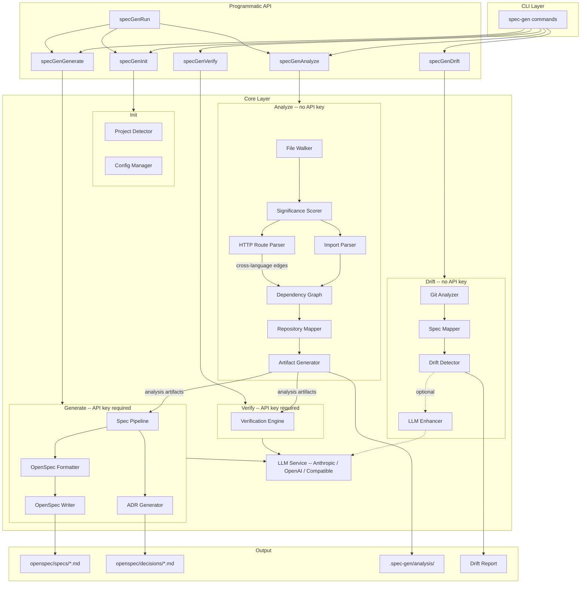

# spec-gen

Extract living specifications from any codebase. Enforce them as code evolves. Generate spec-driven tests from them. Eliminate codebase discovery overhead for AI agents — all from a single tool.

## The Problem

Most software has no specification. The code is the spec — scattered across thousands of files, tribal knowledge, and documentation that was accurate six months ago. Tools like `openspec init` create empty scaffolding, but someone still has to fill it in. By the time specs are written manually, the code has already moved on.

The same problem hits AI agents hard. Every new session starts from zero: the agent reads files, runs grep, tries to infer architecture from directory names, and burns thousands of tokens just answering "what does this code do and where should I touch it?" — before writing a single line. Token budgets are real costs, and discovery is pure waste.

spec-gen solves both. It uses static analysis to understand your codebase structurally — call graph, dependency graph, domain clusters, critical hubs — then an LLM to extract what that code actually *does*, producing [OpenSpec](https://github.com/Fission-AI/OpenSpec)-compatible specifications grounded in reality, not aspiration. The result is absorbed by agents passively at session start, so they arrive with full architectural and business context already in place. Active MCP tools handle anything deeper: graph traversal, semantic search, insertion-point discovery, spec-drift checks.

For human workflows: specs stay in sync via continuous drift detection, and `spec-gen test` turns every spec scenario into an executable test with real assertions — with a coverage gate you can enforce in CI.

## Capabilities at a Glance

| What | Command | API key | Speed |
|---|---|---|---|
| Extract specs from existing code | `spec-gen generate` | Yes | Minutes |
| Detect spec/code divergence | `spec-gen drift` | No | Milliseconds |
| Generate spec-driven tests | `spec-gen test` | No *(LLM optional)* | Seconds |
| Report spec test coverage | `spec-gen test --coverage` | No | Seconds |
| Verify spec accuracy | `spec-gen verify` | Yes | Minutes |
| Give agents pre-loaded architectural context | `spec-gen analyze` → `CODEBASE.md` | No | — |
| Let agents navigate with graph-based tools | `spec-gen mcp` | No | — |
| Inspect the dependency graph visually | `spec-gen view` | No | — |

**Languages supported**: TypeScript · JavaScript · Python · Go · Rust · Ruby · Java · C++ · Swift

## Quick Start

```bash
# Install from npm
npm install -g spec-gen-cli

# Navigate to your project
cd /path/to/your-project

# Run the pipeline
spec-gen init                  # Detect project type, create config
spec-gen analyze --ai-configs  # Static analysis + generate context files (CLAUDE.md, .cursorrules…)
spec-gen setup                 # Install workflow skills (Vibe, Cline, GSD, BMAD)
spec-gen generate              # Generate specs (requires API key)
spec-gen drift                 # Check for spec drift

# Troubleshoot setup issues
spec-gen doctor     # Check environment and configuration
```

<details>
<summary>Install from source</summary>

```bash
git clone https://github.com/clay-good/spec-gen
cd spec-gen
npm install && npm run build && npm link
```

</details>

<details>
<summary>Nix/NixOS</summary>

**Run directly:**

```bash
nix run github:clay-good/spec-gen -- init
nix run github:clay-good/spec-gen -- analyze
nix run github:clay-good/spec-gen -- generate
```

**Temporary shell:**

```bash
nix shell github:clay-good/spec-gen
spec-gen --version
```

**System flake integration:**

```nix
{
  inputs.spec-gen.url = "github:clay-good/spec-gen";

  outputs = { self, nixpkgs, spec-gen }: {
    nixosConfigurations.myhost = nixpkgs.lib.nixosSystem {
      modules = [{
        environment.systemPackages = [ spec-gen.packages.x86_64-linux.default ];
      }];
    };
  };
}
```

**Development:**

```bash
git clone https://github.com/clay-good/spec-gen
cd spec-gen
nix develop
npm run dev
```

</details>

## What It Does

**1. Analyze** (no API key needed)

Scans your codebase using pure static analysis:
- Walks the directory tree, respects .gitignore, scores files by significance
- Parses imports and exports to build a dependency graph (TypeScript, JavaScript, Python, Go, Rust, Ruby, Java, C++, Swift)
- Detects HTTP cross-language edges: matches `fetch`/`axios`/`ky`/`got` calls in JS/TS files to FastAPI/Flask/Django route definitions in Python files, creating cross-language dependency edges with `exact`, `path`, or `fuzzy` confidence
- Resolves Python absolute imports (`from services.retriever import X`) to local files
- Synthesizes cross-file dependency edges from call-graph data for languages without file-level imports (Swift, C++), so the dependency graph and viewer are meaningful even in single-module projects
- Clusters related files into structural business domains automatically
- Extracts DB schema tables (Prisma, TypeORM, Drizzle, SQLAlchemy), HTTP routes (Express, NestJS, Next.js, FastAPI, Flask), UI components (React, Vue, Svelte, Angular), middleware chains, and environment variables — saved as structured JSON artifacts in `.spec-gen/analysis/`
- Generates AI tool config files (`CLAUDE.md`, `.cursorrules`, `.clinerules/`, `.vibe/skills/`, etc.) with `--ai-configs`
- Produces structured context that makes LLM generation more accurate

**2. Generate** (API key required)

Sends the analysis context to an LLM to produce specifications:
- Stage 1: Project survey and categorization
- Stage 2: Entity extraction (core data models)
- Stage 3: Service analysis (business logic)
- Stage 4: API extraction (HTTP endpoints)
- Stage 5: Architecture synthesis (overall structure)
- Stage 6: ADR enrichment (Architecture Decision Records, with `--adr`)

**3. Verify** (API key required)

Tests generated specs by predicting file contents from specs alone, then comparing predictions to actual code. Reports an accuracy score and identifies gaps.

**4. Test Generation** (no API key needed by default)

Turns every spec scenario into an executable test skeleton — or a test with real assertions:
- Parses `#### Scenario:` blocks from spec files and extracts Given/When/Then structure
- THEN clause pattern engine generates real assertions without LLM (status codes, field presence, error messages...)
- `--use-llm` reads mapped function source and enriches unmatched clauses with meaningful assertions
- Supports **Vitest**, **Playwright**, **pytest**, **Google Test**, **Catch2** — auto-detected from your project
- Each test is tagged with a parseable `// spec-gen:` metadata comment enabling coverage tracking
- `--coverage` scans your existing test files and reports which scenarios have tests (by domain, with %)
- `--min-coverage <n>` exits non-zero when coverage drops below threshold — CI gate for spec adherence
- Business-logic controls: annotate scenarios with `<!-- spec-gen-test: priority=high tags=smoke -->` directly in the spec; annotations are auto-generated during `spec-gen generate`

**5. Drift Detection** (no API key needed)

Compares git changes against spec file mappings to find divergence:
- **Gap**: Code changed but its spec was not updated
- **Stale**: Spec references deleted or renamed files
- **Uncovered**: New files with no matching spec domain
- **Orphaned**: Spec declares files that no longer exist
- **ADR gap**: Code changed in a domain referenced by an ADR
- **ADR orphaned**: ADR references domains that no longer exist in specs

## Architecture



## Drift Detection

Drift detection is the core of ongoing spec maintenance. It runs in milliseconds, needs no API key, and works entirely from git diffs and spec file mappings.

```bash
$ spec-gen drift

  Spec Drift Detection

  Analyzing git changes...
  Base ref: main
  Branch: feature/add-notifications
  Changed files: 12

  Loading spec mappings...
  Spec domains: 6
  Mapped source files: 34

  Detecting drift...

   Issues Found: 3

   [ERROR] gap: src/services/user-service.ts
      Spec: openspec/specs/user/spec.md
      File changed (+45/-12 lines) but spec was not updated

   [WARNING] uncovered: src/services/email-queue.ts
      New file has no matching spec domain

   [INFO] adr-gap: openspec/decisions/adr-0001-jwt-auth.md
      Code changed in domain(s) auth referenced by ADR-001

   Summary:
     Gaps: 2
     Uncovered: 1
     ADR gaps: 1
```

### ADR Drift Detection

When `openspec/decisions/` contains Architecture Decision Records, drift detection automatically checks whether code changes affect domains referenced by ADRs. ADR issues are reported at `info` severity since code changes rarely invalidate architectural decisions. Superseded and deprecated ADRs are excluded.

### LLM-Enhanced Mode

Static drift detection catches structural changes but cannot tell whether a change actually affects spec-documented behavior. A variable rename triggers the same alert as a genuine behavior change.

`--use-llm` post-processes gap issues by sending each file's diff and its matching spec to the LLM. The LLM classifies each gap as relevant (keeps the alert) or not relevant (downgrades to info). This reduces false positives.

```bash
spec-gen drift              # Static mode: fast, deterministic
spec-gen drift --use-llm    # LLM-enhanced: fewer false positives
```

## Spec-Driven Tests

`spec-gen test` turns every OpenSpec scenario into an executable test. It reads `#### Scenario:` blocks from your spec files, extracts Given/When/Then structure, and generates test files — with real assertions, not just `expect(true).toBe(true)`.

### Quick Examples

```bash
spec-gen test                              # Auto-detect framework, generate all
spec-gen test --framework pytest           # Force Python/pytest output
spec-gen test --framework gtest            # C++ Google Test
spec-gen test --domains auth,tasks         # Only specific domains
spec-gen test --dry-run                    # Preview without writing
spec-gen test --use-llm                    # Enrich assertions using LLM + mapped functions
spec-gen test --merge                      # Append new scenarios to existing files

spec-gen test --coverage                   # Show spec test coverage report
spec-gen test --coverage --min-coverage 80 # Fail CI if coverage < 80%
spec-gen test --coverage --json            # Machine-readable output
```

### Framework Support

| Framework | Language | Extension | Auto-detected from |
|---|---|---|---|
| `vitest` *(default)* | TypeScript / JavaScript | `.spec.ts` | `package.json` vitest dependency |
| `playwright` | TypeScript / JavaScript | `.spec.ts` | `package.json` playwright dependency |
| `pytest` | Python | `_test.py` | `pyproject.toml` / `setup.py` |
| `gtest` | C++ | `_test.cpp` | `CMakeLists.txt` / `*.cmake` |
| `catch2` | C++ | `_test.cpp` | `CMakeLists.txt` / `*.cmake` |

### Generated Output

Each scenario becomes a test function. The THEN clause pattern engine generates real assertions where possible:

```typescript
// spec-gen: {"domain":"auth","requirement":"UserLogin","scenario":"SuccessfulLogin","specFile":"openspec/specs/auth/spec.md"}
describe("Auth / UserLogin / SuccessfulLogin", () => {
  it("should satisfy spec scenario", async () => {
    // GIVEN: a registered user with email "alice@test.com" and a valid password
    // WHEN: POST /api/auth/login is called with those credentials
    // THEN: the system returns a JWT token, expiry time, and userId with status 200

    // RELATED IMPLEMENTATION:
    // - src/auth/auth-service.ts: login() [llm]

    expect(response.status).toBe(200);
    expect(response.body).toHaveProperty("token");
    expect(response.body).toHaveProperty("expiry");
    expect(response.body).toHaveProperty("userId");
  });
});
```

The `// spec-gen:` metadata tag is parseable by `spec-gen test --coverage` — move the test to any file and coverage tracking still works.

### THEN Clause Pattern Engine

Without `--use-llm`, the pattern engine derives assertions from the THEN clause text:

| THEN clause pattern | Generated assertion (Vitest) |
|---|---|
| `returns status 200` | `expect(response.status).toBe(200)` |
| `returns status 401 with error "..."` | `expect(response.status).toBe(401)` + error field check |
| `returns a JWT token, expiry time, and userId` | `expect(body).toHaveProperty("token")` × 3 |
| `creates the task with status "todo"` | `expect(result).toHaveProperty("status", "todo")` |
| *(unmatched)* | `expect(true).toBe(true) // TODO: implement` |

`--use-llm` reads the source code of mapped functions and sends the scenario + code to the LLM, which fills in the unmatched clauses with real assertions.

### Spec Coverage

```bash
$ spec-gen test --coverage

   Spec Test Coverage Report
   ─────────────────────────────────────────

   Total scenarios:    24
   Covered (tagged):   16
   Uncovered:           8
   Effective coverage: 66.7%  (target: 80%) ✗ below threshold

   By domain:
     auth                   5/6   (83%) ✓
     tasks                  4/6   (67%) ⚠ drift detected
     projects               7/8   (87%) ✓
     database               0/4    (0%) — no tests yet

   Uncovered scenarios:
     auth/UserLogin/MissingFields
     tasks/CreateTask/DuplicateTitle
     ...
```

Domains with active drift issues are flagged, helping you prioritize which tests to write first.

### Priority and Business Logic Controls

Annotate scenarios directly in the spec file to control generation behavior:

```markdown
#### Scenario: SuccessfulLogin
<!-- spec-gen-test: priority=high tags=smoke,regression -->
- **GIVEN** a registered user...

#### Scenario: LegacyTokenBackcompat
<!-- spec-gen-test: skip reason="deprecated in v3, tracked in #1234" -->
- **GIVEN** an old-format token...
```

These annotations are **auto-generated** by `spec-gen generate` using keyword heuristics:
- `tags=smoke` → scenario name/THEN contains *success, valid, create, register*
- `tags=regression` → contains *invalid, error, fail, missing, reject, expired*
- `priority=high` → contains *auth, login, jwt, token, payment, permission, security*
- `priority=low` → contains *legacy, deprecated, backcompat*

Override them manually after generation. The `--tags` and `--exclude-domains` flags respect these annotations at runtime:

```bash
spec-gen test --tags smoke             # Only smoke scenarios
spec-gen test --exclude-domains legacy # Skip the legacy domain
```

### Test Options

```bash
spec-gen test [options]
  --framework <name>       vitest | playwright | pytest | gtest | catch2 | auto
  --domains <list>         Only generate tests for these domains (comma-separated)
  --exclude-domains <list> Skip these domains
  --tags <list>            Only include scenarios carrying ALL these tags
  --output <path>          Output directory (default: spec-tests/)
  --merge                  Append new scenarios to existing test files
  --dry-run                Preview what would be generated without writing
  --use-llm                Use LLM to generate assertions for unmatched THEN clauses
  --limit <n>              Maximum number of scenarios to process
  --coverage               Show spec test coverage report
  --min-coverage <n>       Fail if effective coverage is below N% (CI gate)
  --test-dirs <list>       Directories to scan for coverage (default: spec-tests,src)
  --json                   Machine-readable JSON output
```

## CI/CD Integration

spec-gen is designed to run in automated pipelines. The deterministic commands (`init`, `analyze`, `drift`, `test`) need no API key and produce consistent results.

### Pre-Commit Hook

```bash
spec-gen drift --install-hook     # Install
spec-gen drift --uninstall-hook   # Remove
```

The hook runs in static mode (fast, no API key needed) and blocks commits when drift is detected at warning level or above.

### GitHub Actions / CI Pipelines

```yaml
# .github/workflows/spec-drift.yml
name: Spec Drift Check
on: [pull_request]
jobs:
  drift:
    runs-on: ubuntu-latest
    steps:
      - uses: actions/checkout@v4
        with:
          fetch-depth: 0    # Full history needed for git diff
      - uses: actions/setup-node@v4
        with:
          node-version: '20'
      - run: npm install -g spec-gen-cli
      - run: spec-gen drift --fail-on error --json
```

```bash
# Or in any CI script
spec-gen drift --fail-on error --json    # JSON output, fail on errors only
spec-gen drift --fail-on warning         # Fail on warnings too
spec-gen drift --domains auth,user       # Check specific domains
spec-gen drift --no-color                # Plain output for CI logs
```

### Deterministic vs. LLM-Enhanced

| | Deterministic (Default) | LLM-Enhanced |
|---|---|---|
| **API key** | No | Yes |
| **Speed** | Milliseconds | Seconds per LLM call |
| **Commands** | `analyze`, `drift`, `init` | `generate`, `verify`, `drift --use-llm` |
| **Reproducibility** | Identical every run | May vary |
| **Best for** | CI, pre-commit hooks, quick checks | Initial generation, reducing false positives |

## LLM Providers

spec-gen supports nine providers. The default is Anthropic Claude.

| Provider | `provider` value | API key env var | Default model |
|----------|-----------------|-----------------|---------------|
| Anthropic Claude | `anthropic` *(default)* | `ANTHROPIC_API_KEY` | `claude-sonnet-4-20250514` |
| OpenAI | `openai` | `OPENAI_API_KEY` | `gpt-4o` |
| OpenAI-compatible *(Mistral, Groq, Ollama...)* | `openai-compat` | `OPENAI_COMPAT_API_KEY` | `mistral-large-latest` |
| GitHub Copilot *(via copilot-api proxy)* | `copilot` | *(none)* | `gpt-4o` |
| Google Gemini | `gemini` | `GEMINI_API_KEY` | `gemini-2.0-flash` |
| Gemini CLI | `gemini-cli` | *(none)* | *(CLI default)* |
| Claude Code | `claude-code` | *(none)* | *(CLI default)* |
| Mistral Vibe | `mistral-vibe` | *(none)* | *(CLI default)* |
| Cursor Agent CLI | `cursor-agent` | *(none)* | *(CLI default)* |

### Selecting a provider

Set `provider` (and optionally `model`) in the `generation` block of `.spec-gen/config.json`:

```json
{
  "generation": {
    "provider": "openai",
    "model": "gpt-4o-mini",
    "domains": "auto"
  }
}
```

Override the model for a single run:
```bash
spec-gen generate --model claude-opus-4-20250514
```

### OpenAI-compatible servers (Ollama, Mistral, Groq, LM Studio, vLLM...)

Use `provider: "openai-compat"` with a base URL and API key:

**Environment variables:**
```bash
export OPENAI_COMPAT_BASE_URL=http://localhost:11434/v1   # Ollama, LM Studio, local servers
export OPENAI_COMPAT_API_KEY=ollama                       # any non-empty value for local servers
                                                          # use your real API key for cloud providers (Mistral, Groq...)
```

**Config file** (per-project):
```json
{
  "generation": {
    "provider": "openai-compat",
    "model": "llama3.2",
    "openaiCompatBaseUrl": "http://localhost:11434/v1",
    "domains": "auto"
  }
}
```

**Self-signed certificates** (internal servers, VPN endpoints):
```bash
spec-gen generate --insecure
```
Or in `config.json`:
```json
{
  "generation": {
    "provider": "openai-compat",
    "openaiCompatBaseUrl": "https://internal-llm.corp.net/v1",
    "skipSslVerify": true,
    "domains": "auto"
  }
}
```

Works with: Ollama, LM Studio, Mistral AI, Groq, Together AI, LiteLLM, vLLM,
text-generation-inference, LocalAI, Azure OpenAI, and any `/v1/chat/completions` server.

### GitHub Copilot (via copilot-api proxy)

Use `provider: "copilot"` to generate specs using your GitHub Copilot subscription via the
[copilot-api](https://github.com/ericc-ch/copilot-api) proxy, which exposes an OpenAI-compatible
endpoint from your Copilot credentials.

**Setup:**
1. Install and start the copilot-api proxy:
   ```bash
   npx copilot-api
   ```
   By default it listens on `http://localhost:4141`.

2. Configure spec-gen:
   ```json
   {
     "generation": {
       "provider": "copilot",
       "model": "gpt-4o",
       "domains": "auto"
     }
   }
   ```

**Environment variables** (optional):
```bash
export COPILOT_API_BASE_URL=http://localhost:4141/v1   # default
export COPILOT_API_KEY=copilot                         # default, only needed if proxy requires auth
```

No API key is required — the copilot-api proxy handles authentication via your GitHub Copilot session.

### CLI-based providers (no API key)

Four providers route LLM calls through local CLI tools instead of HTTP APIs. No API key or configuration is needed — just have the CLI installed and on your PATH.

| Provider | CLI binary | Install |
|----------|-----------|----------------|
| `claude-code` | `claude` | [Claude Code](https://docs.anthropic.com/en/docs/claude-code) (requires Claude Max/Pro subscription) |
| `gemini-cli` | `gemini` | [Gemini CLI](https://github.com/google-gemini/gemini-cli) (free tier with Google account) |
| `mistral-vibe` | `vibe` | [Mistral Vibe](https://github.com/mistralai/mistral-vibe) (standalone binary) |
| `cursor-agent` | `cursor-agent` | [Cursor CLI](https://cursor.com/docs/cli/overview) (Cursor subscription / CLI auth) |

```json
{
  "generation": {
    "provider": "claude-code",
    "domains": "auto"
  }
}
```

### Custom base URL for Anthropic or OpenAI

To redirect the built-in Anthropic or OpenAI provider to a proxy or self-hosted endpoint:

```bash
# CLI (one-off)
spec-gen generate --api-base https://my-proxy.corp.net/v1

# Environment variable
export ANTHROPIC_API_BASE=https://my-proxy.corp.net/v1
export OPENAI_API_BASE=https://my-proxy.corp.net/v1
```

Or in `config.json` under the `llm` block:
```json
{
  "llm": {
    "apiBase": "https://my-proxy.corp.net/v1",
    "sslVerify": false
  }
}
```

`sslVerify: false` disables TLS certificate validation -- use only for internal servers with self-signed certificates.

Priority: CLI flags > environment variables > config file > provider defaults.

## Commands

| Command | Description | API Key |
|---------|-------------|---------|
| `spec-gen init` | Initialize configuration | No |
| `spec-gen analyze` | Run static analysis | No |
| `spec-gen generate` | Generate specs from analysis | Yes |
| `spec-gen generate --adr` | Also generate Architecture Decision Records | Yes |
| `spec-gen verify` | Verify spec accuracy | Yes |
| `spec-gen drift` | Detect spec drift (static) | No |
| `spec-gen drift --use-llm` | Detect spec drift (LLM-enhanced) | Yes |
| `spec-gen audit` | Report spec coverage gaps: uncovered functions, hub gaps, stale domains | No |
| `spec-gen test` | Generate spec-driven tests (Vitest / Playwright / pytest / GTest / Catch2) | No |
| `spec-gen test --coverage` | Report which spec scenarios have corresponding tests | No |
| `spec-gen run` | Full pipeline: init, analyze, generate | Yes |
| `spec-gen view` | Launch interactive graph & spec viewer in the browser | No |
| `spec-gen setup` | Install workflow skills into the project (Vibe, Cline, GSD, BMAD) | No |
| `spec-gen mcp` | Start MCP server (stdio, for Cline / Claude Code) | No |
| `spec-gen doctor` | Check environment and configuration for common issues | No |
| `spec-gen refresh-stories` | Refresh story files with latest structural context after each commit | No |

### Global Options

```bash
--api-base <url>       # Custom LLM API base URL (proxy / self-hosted)
--insecure             # Disable SSL certificate verification
--config <path>        # Config file path (default: .spec-gen/config.json)
-q, --quiet            # Errors only
-v, --verbose          # Debug output
--no-color             # Plain text output (enables timestamps)
```

Generate-specific options:
```bash
--model <name>         # Override LLM model (e.g. gpt-4o-mini, llama3.2)
```

### Drift Options

```bash
spec-gen drift [options]
  --base <ref>           # Git ref to compare against (default: auto-detect)
  --files <paths>        # Specific files to check (comma-separated)
  --domains <list>       # Only check specific domains
  --use-llm              # LLM semantic analysis
  --json                 # JSON output
  --fail-on <severity>   # Exit non-zero threshold: error, warning, info
  --max-files <n>        # Max changed files to analyze (default: 100)
  --verbose              # Show detailed issue information
  --install-hook         # Install pre-commit hook
  --uninstall-hook       # Remove pre-commit hook
```

### Generate Options

```bash
spec-gen generate [options]
  --model <name>         # LLM model to use
  --dry-run              # Preview without writing
  --domains <list>       # Only generate specific domains
  --merge                # Merge with existing specs
  --no-overwrite         # Skip existing files
  --adr                  # Also generate ADRs
  --adr-only             # Generate only ADRs
  --reanalyze            # Force fresh analysis even if recent exists
  --analysis <path>      # Path to existing analysis directory
  --output-dir <path>    # Override openspec output location
  -y, --yes              # Skip confirmation prompts
```

### Run Options

```bash
spec-gen run [options]
  --force                # Reinitialize even if config exists
  --reanalyze            # Force fresh analysis even if recent exists
  --model <name>         # LLM model to use for generation
  --dry-run              # Show what would be done without making changes
  -y, --yes              # Skip all confirmation prompts
  --max-files <n>        # Maximum files to analyze (default: 500)
  --adr                  # Also generate Architecture Decision Records
```

### Analyze Options

```bash
spec-gen analyze [options]
  --output <path>        # Output directory (default: .spec-gen/analysis/)
  --max-files <n>        # Max files (default: 500)
  --include <glob>       # Additional include patterns
  --exclude <glob>       # Additional exclude patterns
  --force                # Force re-analysis (bypass 1-hour cache)
  --ai-configs           # Generate AI tool config files (CLAUDE.md, .cursorrules, .clinerules/spec-gen.md,
                         #   .github/copilot-instructions.md, .windsurf/rules.md, .vibe/skills/spec-gen.md)
                         #   Safe to re-run — skips files that already exist, marks pre-existing ones.
  --no-embed             # Skip building the semantic vector index (index is built by default when embedding is configured)
  --reindex-specs        # Re-index OpenSpec specs into the vector index without re-running full analysis
```

### Setup Options

```bash
spec-gen setup [options]
  --tools <list>   Comma-separated tools to install: vibe, cline, gsd, bmad (default: interactive prompt)
  --dir <path>     Project root directory (default: current directory)
```

Installs workflow skills from the spec-gen package into the project. Skills are static assets — identical across projects — so this command only needs to be run once at project onboarding and again after upgrading spec-gen.

Files installed:

| Tool | Destination | Skills |
|------|-------------|--------|
| `vibe` | `.vibe/skills/spec-gen-{name}/SKILL.md` | analyze-codebase, brainstorm, debug, execute-refactor, generate, implement-story, plan-refactor |
| `cline` | `.clinerules/workflows/spec-gen-{name}.md` | analyze-codebase, check-spec-drift, execute-refactor, implement-feature, plan-refactor, refactor-codebase |
| `gsd` | `.claude/commands/gsd/spec-gen-{name}.md` | orient, drift |
| `bmad` | `_bmad/spec-gen/{agents,tasks}/` | agents: architect, dev-brownfield — tasks: implement-story, onboarding, refactor, sprint-planning |

Never overwrites existing files. Combine with `analyze --ai-configs` for a complete agent setup:

```bash
spec-gen analyze --ai-configs   # project-specific context files
spec-gen setup                   # workflow skills
```

### Verify Options

```bash
spec-gen verify [options]
  --samples <n>          # Files to verify (default: 5)
  --threshold <0-1>      # Minimum score to pass (default: 0.7)
  --files <paths>        # Specific files to verify
  --domains <list>       # Only verify specific domains
  --verbose              # Show detailed prediction vs actual comparison
  --json                 # JSON output
```

### Doctor

`spec-gen doctor` runs a self-diagnostic and surfaces actionable fixes when something is misconfigured or missing:

```bash
spec-gen doctor          # Run all checks
spec-gen doctor --json   # JSON output for scripting
```

Checks performed:

| Check | What it looks for |
|-------|------------------|
| Node.js version | ≥ 20 required |
| Git repository | `.git` directory and `git` binary on PATH |
| spec-gen config | `.spec-gen/config.json` exists and is parseable |
| Analysis artifacts | `repo-structure.json` freshness (warns if >24h old) |
| OpenSpec directory | `openspec/specs/` exists |
| LLM provider | API key or `claude` CLI detected |
| Disk space | Warns < 500 MB, fails < 200 MB |

Run `spec-gen doctor` whenever setup instructions aren't working — it tells you exactly what to fix and how.

## Agent Setup

Agents working on an unfamiliar codebase spend the first quarter of every session on discovery: reading files, running grep, inferring architecture from directory names. Each of those file reads costs tokens. On a large codebase, an agent can burn **tens of thousands of tokens** just answering "where do I even start?" — before writing a single line of useful code.

spec-gen eliminates this overhead. Run it once, wire two files into your agent's context, and every subsequent session starts with the agent already knowing:

- which functions are the highest-risk hubs to touch carefully
- where execution enters the system
- which business domains exist and what each one does
- how calls flow between files
- which specs govern which files

The agent arrives informed. No discovery pass. No token budget spent on orientation.

### Passive context vs active tools

There are two ways an agent acquires codebase knowledge:

- **Passive (zero friction, low token cost):** files listed in `CLAUDE.md` / `.clinerules` are injected at session start, before the agent processes your first message. No decision required, no tool calls, no extra round-trips.
- **Active (friction, per-call token cost):** MCP tools must be consciously selected, called, and their output integrated. Even when the information would help, agents often skip this and read files directly — it's always the safe fallback, but it's expensive.

Architectural context delivered passively is far more reliably absorbed and far cheaper. `spec-gen analyze` generates `.spec-gen/analysis/CODEBASE.md` for exactly this purpose: a compact, ~100-line digest that costs a fraction of what reading the equivalent source files would — and it's already pre-digested into what the agent actually needs.

When passive context isn't enough, the MCP tools replace expensive multi-file reads with a single targeted call. `orient` — the main entry point — returns relevant functions, their call neighbours, matching spec sections, and insertion-point candidates in **one round-trip** instead of a dozen `Read` calls.

### What CODEBASE.md contains

Generated from static analysis artifacts, it surfaces what an agent needs before touching code — in ~100 lines instead of reading dozens of source files:

- **Entry points** — functions with no internal callers (where execution starts)
- **Critical hubs** — highest fan-in functions (most risky to modify)
- **Spec domains** — which `openspec/specs/` domains exist and what they cover
- **Most coupled files** — high in-degree in the dependency graph (touch with care)
- **God functions / oversized orchestrators** — complexity hotspots
- **Layer violations** — if any

This is structural signal, not prose. It pairs with `openspec/specs/overview/spec.md`, which provides the functional view: what the system does, what domains exist, data-flow requirements. Together they give agents both the architectural topology and the business intent — **at the cost of two small file reads instead of an unbounded exploration loop**.

### Setup

Two commands, run once per project:

```bash
spec-gen analyze --ai-configs   # generate project-specific context files
spec-gen setup                   # install workflow skills
```

**`analyze --ai-configs`** generates files that are specific to this project — they reference `.spec-gen/analysis/CODEBASE.md` and embed the project name. Safe to re-run (skips existing files).

**`spec-gen setup`** copies static workflow assets from the spec-gen package that are identical across all projects. Run once at onboarding; re-run after upgrading spec-gen to get new or updated skills.

```
spec-gen setup [--tools vibe,cline,gsd,bmad]

Mistral Vibe  ->  .vibe/skills/spec-gen-{name}/SKILL.md      (7 skills)
Cline / Roo   ->  .clinerules/workflows/spec-gen-{name}.md   (6 workflows)
GSD           ->  .claude/commands/gsd/spec-gen-{name}.md    (2 commands)
BMAD          ->  _bmad/spec-gen/{agents,tasks}/              (2 agents, 4 tasks)
```

Wire the generated digest into your agent's context:

**Claude Code** — add to `CLAUDE.md`:

```markdown
@.spec-gen/analysis/CODEBASE.md
@openspec/specs/overview/spec.md

## spec-gen MCP workflow

| Situation | Tool |
|-----------|------|
| Starting any new task | `orient` — returns functions, files, specs, call paths, and insertion points in one call |
| Don't know which file/function handles a concept | `search_code` |
| Need call topology across many files | `get_subgraph` / `analyze_impact` |
| Planning where to add a feature | `suggest_insertion_points` |
| Reading a spec before writing code | `get_spec` |
| Checking if code still matches spec | `check_spec_drift` |
| Finding spec requirements by meaning | `search_specs` |
| Checking spec coverage before starting a feature | `audit_spec_coverage` |

**Follow this sequence for every task:**

1. **`orient "<task description>"`** — always start here. Returns relevant functions, files, spec domains, call paths, and insertion points in one call.
2. **If the task involves data models, APIs, or config** — call the relevant inventory tool:
   `get_schema_inventory` · `get_route_inventory` · `get_env_vars` · `get_ui_components` · `get_middleware_inventory`
3. **If debugging a call flow** ("how does X reach Y?") — `trace_execution_path`
4. **Before modifying a function** — `get_subgraph` to understand blast radius
5. **Before opening a PR** — `check_spec_drift`

**On-demand** (when orient's results aren't enough):
`search_code` · `suggest_insertion_points` · `get_spec <domain>` · `search_specs` · `analyze_impact` · `get_function_body` · `get_function_skeleton`
```

**Cline / Roo Code / Kilocode** — create `.clinerules/spec-gen.md`:

```markdown
# spec-gen

spec-gen provides static analysis artifacts and MCP tools to help you navigate this codebase.
Always use these before writing or modifying code.

## Before starting any task

- Read `.spec-gen/analysis/CODEBASE.md` — architectural digest: entry points, critical hubs,
  god functions, most-coupled files, and available spec domains. Generated locally by `spec-gen analyze`.
- Read `openspec/specs/overview/spec.md` — functional domain map: what the system does,
  which domains exist, data-flow requirements.

## spec-gen MCP workflow

**Follow this sequence for every task:**

1. **`orient "<task description>"`** — always start here. Returns relevant functions, files, spec domains, call paths, and insertion points in one call.
2. **If the task involves data models, APIs, or config** — call the relevant inventory tool:
   `get_schema_inventory` · `get_route_inventory` · `get_env_vars` · `get_ui_components` · `get_middleware_inventory`
3. **If debugging a call flow** ("how does X reach Y?") — `trace_execution_path`
4. **Before modifying a function** — `get_subgraph` to understand blast radius
5. **Before opening a PR** — `check_spec_drift`

**On-demand** (when orient's results aren't enough):
`search_code` · `suggest_insertion_points` · `get_spec <domain>` · `search_specs` · `analyze_impact` · `get_function_body` · `get_function_skeleton`
```

`CODEBASE.md` gives the agent passive architectural context. `overview/spec.md` gives the functional domain map. The workflow tells it exactly what to call and when, without requiring the agent to choose from a menu.

> **Tip:** `spec-gen analyze` prints these snippets after every run as a reminder.

> **Note:** `.spec-gen/analysis/` is git-ignored — each developer generates it locally. Re-run `spec-gen analyze` after significant structural changes to keep the digest current.

**Mistral Vibe (Devstral)** — inject CODEBASE.md into Vibe's global context:

> **Vibe shows "0 skills" after setup?** Check `~/.vibe/config.toml` — if `enabled_skills` is set to a pattern like `["SKILL-*"]` (the old naming format), it won't match the new `spec-gen-*` names. Change it to `["spec-gen-*"]` or `["*"]` to load all skills.

1. Run `spec-gen analyze` to generate `.spec-gen/analysis/CODEBASE.md`
2. Append it to `~/.vibe/prompts/spec-gen.md` so Devstral absorbs it at every session start:

```bash
cat .spec-gen/analysis/CODEBASE.md >> ~/.vibe/prompts/spec-gen.md
```

Or install the Vibe skill (creates a `/spec-gen` slash command in `.vibe/skills/spec-gen.md`):

```bash
spec-gen analyze --ai-configs   # creates .vibe/skills/spec-gen.md
```

Then invoke `/spec-gen` inside Vibe to get architecture context on demand.

---

## MCP Server

`spec-gen mcp` starts spec-gen as a [Model Context Protocol](https://modelcontextprotocol.io/) server over stdio, exposing static analysis as tools that any MCP-compatible AI agent (Cline, Roo Code, Kilocode, Claude Code, Cursor...) can call directly -- no API key required.

### Setup

**Claude Code** -- add a `.mcp.json` at your project root:

```json
{
  "mcpServers": {
    "spec-gen": {
      "command": "spec-gen",
      "args": ["mcp"]
    }
  }
}
```

or for local development:

```json
{
  "mcpServers": {
    "spec-gen": {
      "command": "node",
      "args": ["/absolute/path/to/spec-gen/dist/cli/index.js", "mcp"]
    }
  }
}
```

**Cline / Roo Code / Kilocode** -- add the same block under `mcpServers` in the MCP settings JSON of your editor.

### Watch mode (keep search_code and orient fresh)

By default the MCP server reads `llm-context.json` from the last `analyze` run. With `--watch-auto`, it also watches source files for changes and incrementally re-indexes signatures so `search_code` and `orient` reflect your latest edits without waiting for the next commit.

Add `--watch-auto` to your MCP config args:

```json
{
  "mcpServers": {
    "spec-gen": {
      "command": "spec-gen",
      "args": ["mcp", "--watch-auto"]
    }
  }
}
```

The watcher starts automatically on the first tool call — no hardcoded path needed. It re-extracts signatures for any changed source file and patches `llm-context.json` within ~500 ms of a save. If an embedding server is reachable, it also re-embeds changed functions into the vector index automatically. The call graph is not rebuilt on every change; it stays current via the [post-commit hook](#cicd-integration) (`spec-gen analyze --force`).

| Option | Default | Description |
|---|---|---|
| `--watch-auto` | off | Auto-detect project root from first tool call |
| `--watch <dir>` | — | Watch a fixed directory (alternative to `--watch-auto`) |
| `--watch-debounce <ms>` | 400 | Delay before re-indexing after a file change |

### Cline / Roo Code / Kilocode

For editors with MCP support, after adding the `mcpServers` block to your settings, download the slash command workflows:

```bash
mkdir -p .clinerules/workflows
curl -sL https://raw.githubusercontent.com/clay-good/spec-gen/main/examples/cline-workflows/spec-gen-analyze-codebase.md -o .clinerules/workflows/spec-gen-analyze-codebase.md
curl -sL https://raw.githubusercontent.com/clay-good/spec-gen/main/examples/cline-workflows/spec-gen-check-spec-drift.md -o .clinerules/workflows/spec-gen-check-spec-drift.md
curl -sL https://raw.githubusercontent.com/clay-good/spec-gen/main/examples/cline-workflows/spec-gen-plan-refactor.md -o .clinerules/workflows/spec-gen-plan-refactor.md
curl -sL https://raw.githubusercontent.com/clay-good/spec-gen/main/examples/cline-workflows/spec-gen-execute-refactor.md -o .clinerules/workflows/spec-gen-execute-refactor.md
curl -sL https://raw.githubusercontent.com/clay-good/spec-gen/main/examples/cline-workflows/spec-gen-implement-feature.md -o .clinerules/workflows/spec-gen-implement-feature.md
curl -sL https://raw.githubusercontent.com/clay-good/spec-gen/main/examples/cline-workflows/spec-gen-refactor-codebase.md -o .clinerules/workflows/spec-gen-refactor-codebase.md
```

Available commands:

| Command | What it does |
|---------|-------------|
| `/spec-gen-analyze-codebase` | Runs `analyze_codebase`, summarises the results (project type, file count, top 3 refactor issues, detected domains), shows the call graph highlights, and suggests next steps. |
| `/spec-gen-check-spec-drift` | Runs `check_spec_drift`, presents issues by severity (gap / stale / uncovered / orphaned-spec), shows per-kind remediation commands, and optionally drills into affected file signatures. |
| `/spec-gen-plan-refactor` | Runs static analysis, picks the highest-priority target with coverage gate, assesses impact and call graph, then writes a detailed plan to `.spec-gen/refactor-plan.md`. No code changes. |
| `/spec-gen-execute-refactor` | Reads `.spec-gen/refactor-plan.md`, establishes a green baseline, and applies each planned change one at a time -- with diff verification and test run after every step. Optional final step covers dead-code detection and naming alignment (requires `spec-gen generate`). |
| `/spec-gen-implement-feature` | Plans and implements a new feature with full architectural context: architecture overview, OpenSpec requirements, insertion points, implementation, and drift check. |
| `/spec-gen-refactor-codebase` | Convenience redirect that runs `/spec-gen-plan-refactor` followed by `/spec-gen-execute-refactor`. |

All six commands ask which directory to use, call the MCP tools directly, and guide you through the results without leaving the editor. They work in any editor that supports the `.clinerules/workflows/` convention.

### Claude Skills

For Claude Code, copy the skill files to `.claude/skills/` in your project:

```bash
mkdir -p .claude/skills
curl -sL https://raw.githubusercontent.com/clay-good/spec-gen/main/skills/claude-spec-gen.md -o .claude/skills/claude-spec-gen.md
curl -sL https://raw.githubusercontent.com/clay-good/spec-gen/main/skills/openspec-skill.md -o .claude/skills/openspec-skill.md
```

**Spec-Gen Skill** (`claude-spec-gen.md`) — Code archaeology skill that guides Claude through:
- Project type detection and domain identification
- Entity extraction, service analysis, API extraction
- Architecture synthesis and OpenSpec spec generation

**OpenSpec Skill** (`openspec-skill.md`) — Skill for working with OpenSpec specifications:
- Semantic spec search with `search_specs`
- List domains with `list_spec_domains`
- Navigate requirements and scenarios

### Tools

All tools run on **pure static analysis** -- no LLM quota consumed.

**Run analysis**

| Tool | Description | Requires prior analysis |
|------|-------------|:---:|
| `analyze_codebase` | Run full static analysis: repo structure, dependency graph, call graph (hub functions, entry points, layer violations), and top refactoring priorities. Results cached for 1 hour (`force: true` to bypass). | No |
| `get_call_graph` | Hub functions (high fan-in), entry points (no internal callers), and architectural layer violations. Supports TypeScript, JavaScript, Python, Go, Rust, Ruby, Java, C++, Swift. | Yes |
| `get_signatures` | Compact function/class signatures per file. Filter by path substring with `filePattern`. Useful for understanding a module's public API without reading full source. | Yes |
| `get_duplicate_report` | Detect duplicate code: Type 1 (exact clones), Type 2 (structural -- renamed variables), Type 3 (near-clones with Jaccard similarity >= 0.7). Groups sorted by impact. | Yes |

**Explore & Navigate**

| Tool | Description | Requires prior analysis |
|------|-------------|:---:|
| `orient` | **Single entry point for any new task.** Given a natural-language task description, returns in one call: relevant functions, source files, spec domains, call neighbourhoods, insertion-point candidates, and matching spec sections. Start here. | Yes (+ embedding) |
| `search_code` | Natural-language semantic search over indexed functions. Returns the closest matches by meaning with similarity score, call-graph neighbourhood enrichment, and spec-linked peer functions. Falls back to BM25 keyword search when no embedding server is configured. | Yes (+ embedding) |
| `suggest_insertion_points` | Semantic search over the vector index to find the best existing functions to extend or hook into when implementing a new feature. Returns ranked candidates with role and strategy. Falls back to BM25 keyword search when no embedding server is configured. | Yes (+ embedding) |
| `get_subgraph` | Depth-limited subgraph centred on a function. Direction: `downstream` (what it calls), `upstream` (who calls it), or `both`. Output as JSON or Mermaid diagram. | Yes |
| `trace_execution_path` | Find all call-graph paths between two functions (DFS, configurable depth/max-paths). Use this when debugging: "how does request X reach function Y?" Returns shortest path, all paths sorted by hops, and a step-by-step chain per path. | Yes |
| `get_function_body` | Return the exact source code of a named function in a file. | No |
| `get_function_skeleton` | Noise-stripped view of a source file: logs, inline comments, and non-JSDoc block comments removed. Signatures, control flow, return/throw, and call expressions preserved. Returns reduction %. | No |
| `get_file_dependencies` | Return the file-level import dependencies for a given source file (imports, imported-by, or both). | Yes |
| `get_architecture_overview` | High-level cluster map: roles (entry layer, orchestrator, core utilities, API layer, internal), inter-cluster dependencies, global entry points, and critical hubs. No LLM required. | Yes |
| `get_signatures` | Compact function/class signatures per file. Filter by path substring with `filePattern`. Useful for understanding a module's public API without reading full source. | Yes |

**Stack inventory**

| Tool | Description | Requires prior analysis |
|------|-------------|:---:|
| `get_route_inventory` | All detected HTTP routes with method, path, handler, and framework. Supports Express, NestJS, Next.js, FastAPI, Flask, and more. | Yes |
| `get_schema_inventory` | ORM schema tables with field names and types. Supports Prisma, TypeORM, Drizzle, and SQLAlchemy. | Yes |
| `get_ui_components` | Detected UI components with framework, props, and source file. Supports React, Vue, Svelte, and Angular. | Yes |
| `get_env_vars` | Env vars referenced in source code with `required` (no fallback) and `hasDefault` flags. Supports JS/TS, Python, Go, and Ruby. | Yes |
| `get_middleware_inventory` | Detected middleware with type (auth/cors/rate-limit/validation/logging/error-handler) and framework. | Yes |

**Code quality**

| Tool | Description | Requires prior analysis |
|------|-------------|:---:|
| `get_call_graph` | Hub functions (high fan-in), entry points (no internal callers), and architectural layer violations. Supports TypeScript, JavaScript, Python, Go, Rust, Ruby, Java, C++. | Yes |
| `get_refactor_report` | Prioritized list of functions with structural issues: unreachable code, hub overload (high fan-in), god functions (high fan-out), SRP violations, cyclic dependencies. | Yes |
| `get_critical_hubs` | Highest-impact hub functions ranked by criticality. Each hub gets a stability score (0-100) and a recommended approach: extract, split, facade, or delegate. | Yes |
| `get_god_functions` | Detect god functions (high fan-out, likely orchestrators) in the project or in a specific file, and return their call-graph neighborhood. Use this to identify which functions need to be refactored and understand what logical blocks to extract. | Yes |
| `analyze_impact` | Deep impact analysis for a specific function: fan-in/fan-out, upstream call chain, downstream critical path, risk score (0-100), blast radius, and recommended strategy. | Yes |
| `get_low_risk_refactor_candidates` | Safest functions to refactor first: low fan-in, low fan-out, not a hub, no cyclic involvement. Best starting point for incremental, low-risk sessions. | Yes |
| `get_leaf_functions` | Functions that make no internal calls (leaves of the call graph). Zero downstream blast radius. Sorted by fan-in by default -- most-called leaves have the best unit-test ROI. | Yes |
| `get_duplicate_report` | Detect duplicate code: Type 1 (exact clones), Type 2 (structural -- renamed variables), Type 3 (near-clones with Jaccard similarity >= 0.7). Groups sorted by impact. | Yes |

**Specs**

| Tool | Description | Requires prior analysis |
|------|-------------|:---:|
| `get_spec` | Read the full content of an OpenSpec domain spec by domain name. | Yes (generate) |
| `get_mapping` | Requirement->function mapping produced by `spec-gen generate`. Shows which functions implement which spec requirements, confidence level, and orphan functions with no spec coverage. | Yes (generate) |
| `get_decisions` | List or search Architecture Decision Records (ADRs) stored in `openspec/decisions/`. Optional keyword query. | Yes (generate) |
| `check_spec_drift` | Detect code changes not reflected in OpenSpec specs. Compares git-changed files against spec coverage maps. Issues: gap / stale / uncovered / orphaned-spec / adr-gap. | Yes (generate) |
| `search_specs` | Semantic search over OpenSpec specifications to find requirements, design notes, and architecture decisions by meaning. Returns linked source files for graph highlighting. Use this when asked "which spec covers X?" or "where should we implement Z?". Requires a spec index built with `spec-gen analyze` or `--reindex-specs`. | Yes (generate) |
| `list_spec_domains` | List all OpenSpec domains available in this project. Use this to discover what domains exist before doing a targeted `search_specs` call. | Yes (generate) |
| `audit_spec_coverage` | Parity audit: uncovered functions (in call graph, no spec), hub gaps (high fan-in + no spec), orphan requirements (spec with no implementation found), and stale domains (source changed after spec). Run before starting a feature to understand coverage health. No LLM required. | Yes (analyze) |

**Story Management**

| Tool | Description | Requires prior analysis |
|------|-------------|:---:|
| `generate_change_proposal` | Generate a structured change proposal for a feature: affected functions, risk score, insertion points, spec impact, and a ready-to-use story file. Use during sprint planning or before implementing a non-trivial change. | Yes |
| `annotate_story` | Annotate an existing story file with structural context: risk score, affected functions, recommended insertion point, and spec domain links. Prepares a story for the dev agent so it can skip the orientation step. | Yes |

### Parameters

**`orient`**
```
directory  string   Absolute path to the project directory
task       string   Natural-language description of the task, e.g. "add rate limiting to the API"
limit      number   Max relevant functions to return (default: 5, max: 20)
```

**`analyze_codebase`**
```
directory  string   Absolute path to the project directory
force      boolean  Force re-analysis even if cache is fresh (default: false)
```

**`get_refactor_report`**, **`get_call_graph`**
```
directory  string   Absolute path to the project directory
```

**`get_signatures`**
```
directory    string   Absolute path to the project directory
filePattern  string   Optional path substring filter (e.g. "services", ".py")
```

**`get_subgraph`**
```
directory     string   Absolute path to the project directory
functionName  string   Function name to centre on (case-insensitive partial match)
direction     string   "downstream" | "upstream" | "both"  (default: "downstream")
maxDepth      number   BFS traversal depth limit  (default: 3)
format        string   "json" | "mermaid"  (default: "json")
```

*Note: If no exact name match is found, `get_subgraph` falls back to semantic search (when a vector index is available) to find the most similar function.*

**`get_mapping`**
```
directory    string    Absolute path to the project directory
domain       string    Optional domain filter (e.g. "auth", "crawler")
orphansOnly  boolean   Return only orphan functions (default: false)
```

**`get_duplicate_report`**
```
directory  string   Absolute path to the project directory
```

**`check_spec_drift`**
```
directory  string    Absolute path to the project directory
base       string    Git ref to compare against (default: auto-detect main/master)
files      string[]  Specific files to check (default: all changed files)
domains    string[]  Only check these spec domains (default: all)
failOn     string    Minimum severity to report: "error" | "warning" | "info" (default: "warning")
maxFiles   number    Max changed files to analyze (default: 100)
```

**`list_spec_domains`**
```
directory  string   Absolute path to the project directory
```

**`analyze_impact`**
```
directory  string   Absolute path to the project directory
symbol     string   Function or method name (exact or partial match)
depth      number   Traversal depth for upstream/downstream chains (default: 2)
```

*Note: If no exact name match is found, `analyze_impact` falls back to semantic search (when a vector index is available) to find the most similar function.*

**`get_low_risk_refactor_candidates`**
```
directory    string   Absolute path to the project directory
limit        number   Max candidates to return (default: 5)
filePattern  string   Optional path substring filter (e.g. "services", ".py")
```

**`get_leaf_functions`**
```
directory    string   Absolute path to the project directory
limit        number   Max results to return (default: 20)
filePattern  string   Optional path substring filter
sortBy       string   "fanIn" (default) | "name" | "file"
```

**`get_critical_hubs`**
```
directory  string   Absolute path to the project directory
limit      number   Max hubs to return (default: 10)
minFanIn   number   Minimum fan-in threshold to be considered a hub (default: 3)
```

**`get_architecture_overview`**
```
directory  string   Absolute path to the project directory
```

**`get_function_skeleton`**
```
directory  string   Absolute path to the project directory
filePath   string   Path to the file, relative to the project directory
```

**`get_function_body`**
```
directory     string   Absolute path to the project directory
filePath      string   Path to the file, relative to the project directory
functionName  string   Name of the function to extract
```

**`get_file_dependencies`**
```
directory  string   Absolute path to the project directory
filePath   string   Path to the file, relative to the project directory
direction  string   "imports" | "importedBy" | "both"  (default: "both")
```

**`trace_execution_path`**
```
directory       string   Absolute path to the project directory
entryFunction   string   Name of the starting function (case-insensitive partial match)
targetFunction  string   Name of the target function (case-insensitive partial match)
maxDepth        number   Maximum path length in hops (default: 6)
maxPaths        number   Maximum number of paths to return (default: 10, max: 50)
```

**`get_decisions`**
```
directory  string   Absolute path to the project directory
query      string   Optional keyword to filter ADRs by title or content
```

**`get_spec`**
```
directory  string   Absolute path to the project directory
domain     string   Domain name (e.g. "auth", "user", "api")
```

**`get_god_functions`**
```
directory        string   Absolute path to the project directory
filePath         string   Optional: restrict search to this file (relative path)
fanOutThreshold  number   Minimum fan-out to be considered a god function (default: 8)
```

**`suggest_insertion_points`**
```
directory    string   Absolute path to the project directory
description  string   Natural-language description of the feature to implement
limit        number   Max candidates to return (default: 5)
language     string   Filter by language: "TypeScript" | "Python" | "Go" | ...
```

**`search_code`**
```
directory  string   Absolute path to the project directory
query      string   Natural-language query, e.g. "authenticate user with JWT"
limit      number   Max results (default: 10)
language   string   Filter by language: "TypeScript" | "Python" | "Go" | ...
minFanIn   number   Only return functions with at least this many callers
```

**`search_specs`**
```
directory  string   Absolute path to the project directory
query      string   Natural language query, e.g. "email validation workflow"
limit      number   Maximum number of results to return (default: 10)
domain     string   Filter by domain name (e.g. "auth", "analyzer")
section    string   Filter by section type: "requirements" | "purpose" | "design" | "architecture" | "entities"
```

**`generate_change_proposal`**
```
directory     string   Absolute path to the project directory
description   string   Natural-language description of the change (story, intent, or spec delta)
slug          string   URL-safe identifier for the proposal (e.g. "add-payment-retry")
storyContent  string   Optional full story markdown to embed in the proposal
```

**`annotate_story`**
```
directory      string   Absolute path to the project directory
storyFilePath  string   Path to the story file (relative to project root or absolute)
description    string   Natural-language summary of the story for structural analysis
```

### Typical workflow

**Scenario A -- Initial exploration**
```
1. analyze_codebase({ directory })                    # repo structure + call graph + top issues
2. get_call_graph({ directory })                      # hub functions + layer violations
3. get_duplicate_report({ directory })                # clone groups to consolidate
4. get_refactor_report({ directory })                 # prioritized refactoring candidates
```

**Scenario B -- Targeted refactoring**
```
1. analyze_impact({ directory, symbol: "myFunction" })       # risk score + blast radius + strategy
2. get_subgraph({ directory, functionName: "myFunction",     # Mermaid call neighbourhood
                  direction: "both", format: "mermaid" })
3. get_low_risk_refactor_candidates({ directory,             # safe entry points to extract first
                                      filePattern: "myFile" })
4. get_leaf_functions({ directory, filePattern: "myFile" })  # zero-risk extraction targets
```

**Scenario C -- Spec maintenance**
```
1. check_spec_drift({ directory })                    # code changes not reflected in specs
2. get_mapping({ directory, orphansOnly: true })      # functions with no spec coverage
```

**Scenario D -- Starting a new task (fastest orientation)**
```
1. orient({ directory, task: "add rate limiting to the API" })
   # Returns in one call:
   #   - relevant functions (semantic search or BM25 fallback)
   #   - source files and spec domains that cover them
   #   - call-graph neighbourhood for each top function
   #   - best insertion-point candidates
   #   - spec-linked peer functions (cross-graph traversal)
   #   - matching spec sections
2. get_spec({ directory, domain: "..." })             # read full spec before writing code
3. check_spec_drift({ directory })                    # verify after implementation
```

**Scenario E -- Coverage audit before implementing**
```
1. audit_spec_coverage({ directory })
   # Before writing code: surfaces stale domains, uncovered hub functions,
   # orphan requirements. 0 LLM calls, ~200ms.
2. If staleDomains includes your target: spec-gen generate --domains $DOMAIN
3. If hubGaps includes a function you'll touch: flag it in your risk check
```

---

## Agentic Workflows

spec-gen integrates with structured agentic workflows so AI agents follow a consistent process: orient → risk check → spec check → implement → drift verify.

| Integration | Description | Location |
|-------------|-------------|----------|
| **BMAD** | Brownfield agent workflow with architect + dev agents. Architect annotates stories with risk context at planning time; dev agent uses it to skip orientation on low-risk stories. | `examples/bmad/` |
| **Mistral Vibe** | Skills for Mistral-powered agents (brainstorm, implement story, debug, plan/execute refactor). Includes small-model constraints (≤50-line edits). | `examples/mistral-vibe/` |
| **GSD** | Minimal slash commands for `spec-gen orient` and `spec-gen drift` — drop into any agent that supports custom commands. | `examples/gsd/` |
| **spec-kit** | Extension layer adding structural risk analysis to any existing agent setup. | `examples/spec-kit/` |
| **Cline** | Workflow markdown files for Cline / Roo Code / Kilocode. Copy to `.clinerules/workflows/`. | `examples/cline-workflows/` |

Each integration ships with a README explaining setup and the step-by-step workflow.

## Interactive Graph Viewer

`spec-gen view` launches a local React app that visualises your codebase analysis and lets you explore spec requirements side-by-side with the dependency graph.

```bash
# Run analysis first (if not already done)
spec-gen analyze

# Launch the viewer (opens browser automatically)
spec-gen view

# Options
spec-gen view --port 4000          # custom port (default: 5173)
spec-gen view --host 0.0.0.0       # expose on LAN
spec-gen view --no-open            # don't open browser automatically
spec-gen view --analysis <path>    # custom analysis dir (default: .spec-gen/analysis/)
spec-gen view --spec <path>        # custom spec dir (default: ./openspec/specs/)
```

### Views

| View | Description |
|------|-------------|
| **Clusters** | Colour-coded architectural clusters with expandable member nodes. Falls back to directory clusters for languages without import edges (Swift, C++) |
| **Flat** | Force-directed dependency graph (all nodes). Import edges are solid; call edges (Swift/C++ synthesised, or HTTP cross-language) are cyan dashed |
| **Classes** | Class/struct inheritance and call graph. Nodes coloured by language or connected component; isolated nodes hidden. Component-aware force layout keeps related classes together |
| **Architecture** | High-level cluster map: role-coloured boxes, inter-cluster dependency arrows |
| **Classes** | Component-aware force layout of class/struct relationships with coloured groupings |

### Diagram Chat

The right sidebar includes a **Diagram Chat** panel powered by an LLM agent. The chat can access all analysis tools and interact with the graph:

- Ask questions about your codebase in natural language
- Graph functions and requirements mentioned in answers are automatically highlighted
- Clusters containing highlighted nodes auto-expand to reveal the nodes
- Select a node in the chat to view its details tab

Example queries:
- "What are the most critical functions?"
- "Where would I add a new API endpoint?"
- "Show me the impact of changing the authentication service"

The chat requires an LLM API key (same provider configuration as `spec-gen generate`). Viewer-only operations like graph browsing, skeleton view, and search do not require an API key.

### Right panel tabs (select a node to activate)

| Tab | Content |
|-----|---------|
| **Node** | File metadata: exports, language, score |
| **Links** | Direct callers and callees |
| **Blast** | Downstream impact radius |
| **Spec** | Requirements linked to the selected file -- body, domain, confidence |
| **Skeleton** | Noise-stripped source: logs and comments removed, structure preserved |
| **Info** | Global stats and top-ranked files |

### Search

The search bar filters all three views simultaneously (text match on name, path, exports, tags). If a vector index was built with `--embed`, typing >= 3 characters also queries the semantic index and shows the top 5 function matches in a dropdown.

### Automatic data loading

The viewer auto-loads all available data on startup:

| Endpoint | Source | Required? |
|----------|--------|-----------|
| `/api/dependency-graph` | `.spec-gen/analysis/dependency-graph.json` | Yes |
| `/api/llm-context` | `.spec-gen/analysis/llm-context.json` | No |
| `/api/refactor-priorities` | `.spec-gen/analysis/refactor-priorities.json` | No |
| `/api/mapping` | `.spec-gen/analysis/mapping.json` | No |
| `/api/spec-requirements` | `openspec/specs/**/*.md` + `mapping.json` | No |
| `/api/skeleton?file=` | Source file on disk | No |
| `/api/search?q=` | `.spec-gen/analysis/vector-index/` | No (`--embed`) |

Run `spec-gen generate` to produce `mapping.json` and the spec files. Once present, the **Spec** tab shows the full requirement body for each selected file.

### View Options

```bash
spec-gen view [options]
  --analysis <path>    Analysis directory (default: .spec-gen/analysis/)
  --spec <path>        Spec files directory (default: ./openspec/specs/)
  --port <n>           Port (default: 5173)
  --host <host>        Bind host (default: 127.0.0.1; use 0.0.0.0 for LAN)
  --no-open            Skip automatic browser open
```

## Output

spec-gen writes to the OpenSpec directory structure:

```
openspec/
  config.yaml                # Project metadata
  specs/
    overview/spec.md         # System overview
    architecture/spec.md     # Architecture
    auth/spec.md             # Domain: Authentication
    user/spec.md             # Domain: User management
    api/spec.md              # API specification
  decisions/                 # With --adr flag
    index.md                 # ADR index
    adr-0001-*.md            # Individual decisions
```

Each spec uses RFC 2119 keywords (SHALL, MUST, SHOULD), Given/When/Then scenarios, and technical notes linking to implementation files.

### Analysis Artifacts

Static analysis output is stored in `.spec-gen/analysis/`:

| File | Description |
|------|-------------|
| `repo-structure.json` | Project structure and metadata |
| `dependency-graph.json` | Import/export relationships, HTTP cross-language edges (JS/TS → Python), and synthesised call edges for Swift/C++ |
| `llm-context.json` | Context prepared for LLM (signatures, call graph) |
| `dependencies.mermaid` | Visual dependency graph |
| `SUMMARY.md` | Human-readable analysis summary |
| `call-graph.json` | Function-level call graph (8 languages: TS/JS, Python, Go, Rust, Ruby, Java, C++, Swift) |
| `refactor-priorities.json` | Refactoring issues by file and function |
| `mapping.json` | Requirement->function mapping (produced by `generate`) |
| `spec-snapshot.json` | Compact coverage summary: git state, per-domain coverage %, uncovered hub functions (auto-updated after `analyze` and `generate`) |
| `audit-report.json` | Latest parity audit report (produced by `spec-gen audit`) |
| `vector-index/` | LanceDB semantic index (produced by `--embed`) |

`spec-gen analyze` also writes **`ARCHITECTURE.md`** to your project root -- a Markdown overview of module clusters, entry points, and critical hubs, refreshed on every run.

## Semantic Search & GraphRAG

`spec-gen analyze` builds a vector index over all functions in the call graph, enabling natural-language search via the `search_code`, `orient`, and `suggest_insertion_points` MCP tools, and the search bar in the viewer.

### GraphRAG retrieval expansion

Semantic search is only the starting point. spec-gen combines three retrieval layers into every search result — this is what makes it genuinely useful for AI agents navigating unfamiliar codebases:

1. **Semantic seed** — dense vector search (or BM25 keyword fallback) finds the top-N functions closest in meaning to the query.
2. **Call-graph expansion** — BFS up to depth 2 follows callee edges from every seed function, pulling in the files those functions depend on. During `generate`, this ensures the LLM sees the full call neighbourhood, not just the most obvious files.
3. **Spec-linked peer functions** — each seed function's spec domain is looked up in the requirement→function mapping. Functions from the same spec domain that live in *different files* are surfaced as `specLinkedFunctions`. This crosses the call-graph boundary: implementations that share a spec requirement but are not directly connected by calls are retrieved automatically.

The result: a single `orient` or `search_code` call returns not just "functions that mention this concept" but the interconnected cluster of code and specs that collectively implement it. Agents spend less time chasing cross-file references manually and more time making changes with confidence.

### Embedding configuration

Provide an OpenAI-compatible embedding endpoint (Ollama, OpenAI, Mistral, etc.) via environment variables or `.spec-gen/config.json`:

**Environment variables:**
```bash
EMBED_BASE_URL=https://api.openai.com/v1
EMBED_MODEL=text-embedding-3-small
EMBED_API_KEY=sk-...         # optional for local servers

# Then run (embedding is automatic when configured):
spec-gen analyze
```

**Config file (`.spec-gen/config.json`):**
```json
{
  "embedding": {
    "baseUrl": "http://localhost:11434/v1",
    "model": "nomic-embed-text",
    "batchSize": 64
  }
}
```

- `batchSize`: Number of texts to embed per API call (default: 64)

The index is stored in `.spec-gen/analysis/vector-index/` and is automatically used by the viewer's search bar and the `search_code` / `suggest_insertion_points` MCP tools.

## Configuration

`spec-gen init` creates `.spec-gen/config.json`:

```json
{
  "version": "1.0.0",
  "projectType": "nodejs",
  "openspecPath": "./openspec",
  "analysis": {
    "maxFiles": 500,
    "includePatterns": [],
    "excludePatterns": []
  },
  "generation": {
    "model": "claude-sonnet-4-20250514",
    "domains": "auto"
  }
}
```

### Environment Variables

| Variable | Provider | Description |
|----------|----------|-------------|
| `ANTHROPIC_API_KEY` | `anthropic` | Anthropic API key |
| `ANTHROPIC_API_BASE` | `anthropic` | Custom base URL (proxy / self-hosted) |
| `OPENAI_API_KEY` | `openai` | OpenAI API key |
| `OPENAI_API_BASE` | `openai` | Custom base URL (Azure, proxy...) |
| `OPENAI_COMPAT_API_KEY` | `openai-compat` | API key for OpenAI-compatible server |
| `OPENAI_COMPAT_BASE_URL` | `openai-compat` | Base URL, e.g. `https://api.mistral.ai/v1` |
| `GEMINI_API_KEY` | `gemini` | Google Gemini API key |
| `COPILOT_API_BASE_URL` | `copilot` | Base URL of the copilot-api proxy (default: `http://localhost:4141/v1`) |
| `COPILOT_API_KEY` | `copilot` | API key if the proxy requires auth (default: `copilot`) |
| `EMBED_BASE_URL` | embedding | Base URL for the embedding API (e.g. `http://localhost:11434/v1`) |
| `EMBED_MODEL` | embedding | Embedding model name (e.g. `nomic-embed-text`) |
| `EMBED_API_KEY` | embedding | API key for the embedding service (defaults to `OPENAI_API_KEY`) |
| `DEBUG` | -- | Enable stack traces on errors |
| `CI` | -- | Auto-detected; enables timestamps in output |

## Requirements

- Node.js 20+
- API key for `generate`, `verify`, and `drift --use-llm` -- set the env var for your chosen provider:
  ```bash
  export ANTHROPIC_API_KEY=sk-ant-...       # Anthropic (default)
  export OPENAI_API_KEY=sk-...              # OpenAI
  export OPENAI_COMPAT_API_KEY=ollama       # OpenAI-compatible local server
  export GEMINI_API_KEY=...                 # Google Gemini
  ```
  Or use a CLI-based provider (`claude-code`, `gemini-cli`, `mistral-vibe`, `cursor-agent`) which requires no API key — just the CLI tool on your PATH.
- `analyze`, `drift`, and `init` require no API key

## Supported Languages

| Language | Signatures | Call Graph | Notes |
|----------|-----------|------------|-------|
| TypeScript / JavaScript | Full | Full | Best results — rich type info |
| Python | Full | Full | `self`/`cls` intra-class + import resolution |
| Go | Full | Full | |
| Rust | Full | Full | |
| Ruby | Full | Full | |
| Java | Full | Full | |
| C++ | Full | Full | No intra-module imports — cross-file edges synthesised from call graph |
| Swift | Full | Full | No intra-module imports — cross-file edges synthesised from call graph |

## Usage Options

**CLI Tool** (recommended):
```bash
spec-gen init && spec-gen analyze && spec-gen generate && spec-gen drift --install-hook
```

**Claude Code Skill**: Copy `skills/claude-spec-gen.md` to `.claude/skills/` in your project.

**OpenSpec Skill**: Copy `skills/openspec-skill.md` to your OpenSpec skills directory.

**Direct LLM Prompting**: Use `AGENTS.md` as a system prompt for any LLM.

**Programmatic API**: Import spec-gen as a library in your own tools.

## Programmatic API

spec-gen exposes a typed Node.js API for integration into other tools (like [OpenSpec CLI](https://github.com/Fission-AI/OpenSpec)). Every CLI command has a corresponding API function that returns structured results instead of printing to the console.

```bash
npm install spec-gen-cli
```

```typescript
import { specGenAnalyze, specGenDrift, specGenRun } from 'spec-gen';

// Run the full pipeline
const result = await specGenRun({
  rootPath: '/path/to/project',
  adr: true,
  onProgress: (event) => console.log(`[${event.phase}] ${event.step}`),
});
console.log(`Generated ${result.generation.report.filesWritten.length} specs`);

// Check for drift
const drift = await specGenDrift({
  rootPath: '/path/to/project',
  failOn: 'warning',
});
if (drift.hasDrift) {
  console.warn(`${drift.summary.total} drift issues found`);
}

// Static analysis only (no API key needed)
const analysis = await specGenAnalyze({
  rootPath: '/path/to/project',
  maxFiles: 1000,
});
console.log(`Analyzed ${analysis.repoMap.summary.analyzedFiles} files`);
```

### API Functions

| Function | Description | API Key |
|----------|-------------|---------|
| `specGenInit(options?)` | Initialize config and openspec directory | No |
| `specGenAnalyze(options?)` | Run static analysis | No |
| `specGenGenerate(options?)` | Generate specs from analysis | Yes |
| `specGenVerify(options?)` | Verify spec accuracy | Yes |
| `specGenDrift(options?)` | Detect spec-to-code drift | No* |
| `specGenRun(options?)` | Full pipeline: init + analyze + generate | Yes |
| `specGenAudit(options?)` | Parity audit: uncovered functions, hub gaps, orphan requirements, stale domains | No |
| `specGenGetSpecRequirements(options?)` | Read requirement blocks from generated specs | No |

\* `specGenDrift` requires an API key only when `llmEnhanced: true`.

All functions accept an optional `onProgress` callback for status updates and throw errors instead of calling `process.exit`. See [src/api/types.ts](src/api/types.ts) for full option and result type definitions.

### Error handling

All API functions throw `Error` on failure. Wrap calls in try-catch for production use:

```typescript
import { specGenRun } from 'spec-gen-cli';

try {
  const result = await specGenRun({ rootPath: '/path/to/project' });
  console.log(`Done — ${result.generation.report.filesWritten.length} specs written`);
} catch (err) {
  if ((err as Error).message.includes('API key')) {
    console.error('Set ANTHROPIC_API_KEY or OPENAI_API_KEY');
  } else {
    console.error('spec-gen failed:', (err as Error).message);
  }
}
```

### Reading generated spec requirements

After running `specGenGenerate`, you can programmatically query the requirement-to-function mapping:

```typescript
import { specGenGetSpecRequirements } from 'spec-gen-cli';

const { requirements } = await specGenGetSpecRequirements({ rootPath: '/path/to/project' });
for (const [key, req] of Object.entries(requirements)) {
  console.log(`${key}: ${req.title} (${req.specFile})`);
}
```

## Examples

| Example | Description |
|---------|-------------|
| [examples/openspec-analysis/](examples/openspec-analysis/) | Static analysis output from `spec-gen analyze` |
| [examples/openspec-cli/](examples/openspec-cli/) | Specifications generated with `spec-gen generate` |
| [examples/drift-demo/](examples/drift-demo/) | Sample project configured for drift detection |
| [examples/bmad/](examples/bmad/) | BMAD Method integration — agents, tasks, templates for brownfield codebases |
| [examples/mistral-vibe/](examples/mistral-vibe/) | Mistral Vibe skills for analyze, generate, plan-refactor, implement-story |
| [examples/spec-kit/](examples/spec-kit/) | spec-kit extension with `before_implement` / `after_implement` hooks |
| [examples/gsd/](examples/gsd/) | Get-Shit-Done Claude Code commands for orient + drift |

## Development

```bash
npm install          # Install dependencies
npm run dev          # Development mode (watch)
npm run build        # Build
npm run test:run     # Run tests (2300+ unit tests)
npm run typecheck    # Type check
```

2300+ unit tests covering static analysis, call graph (including Swift), refactor analysis, spec mapping, drift detection, LLM enhancement, ADR generation, MCP handlers, change proposals, cross-file edge synthesis, and the full CLI.

## Links

- [OpenSpec](https://github.com/Fission-AI/OpenSpec) - Spec-driven development framework
- [Architecture](docs/ARCHITECTURE.md) - Internal design and module organization
- [Algorithms](docs/ALGORITHMS.md) - Analysis algorithms
- [OpenSpec Integration](docs/OPENSPEC-INTEGRATION.md) - How spec-gen integrates with OpenSpec
- [OpenSpec Format](docs/OPENSPEC-FORMAT.md) - Spec format reference
- [Philosophy](docs/PHILOSOPHY.md) - "Archaeology over Creativity"
- [Agentic Workflows](docs/agentic-workflows/) - Integration patterns for BMAD, Mistral Vibe, spec-kit, GSD
- [Troubleshooting](docs/TROUBLESHOOTING.md) - Common issues and solutions
- [AGENTS.md](AGENTS.md) - LLM system prompt for direct prompting
