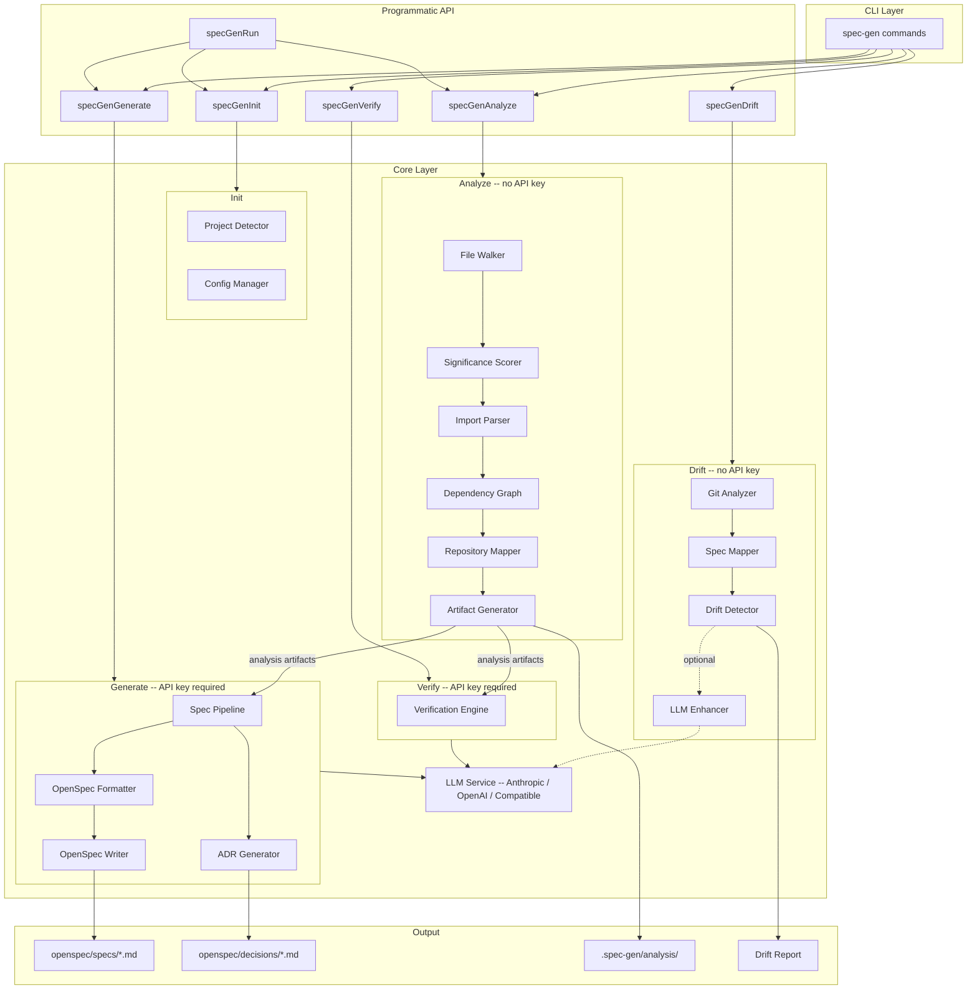

# spec-gen

Reverse-engineer [OpenSpec](https://github.com/Fission-AI/OpenSpec) specifications from existing codebases, then keep them in sync as code evolves.

## The Problem

Most software has no specification. The code is the spec, scattered across thousands of files, tribal knowledge, and stale documentation. Tools like `openspec init` create empty scaffolding, but someone still has to write everything. By the time specs are written manually, the code has already changed.

spec-gen automates this. It analyzes your codebase through static analysis, generates structured specifications using an LLM, and continuously detects when code and specs fall out of sync.

## Quick Start

```bash
# Install
git clone https://github.com/clay-good/spec-gen
cd spec-gen
npm install && npm run build && npm link

# Navigate to your project
cd /path/to/your-project

# Run the pipeline
spec-gen init       # Detect project type, create config
spec-gen analyze    # Static analysis (no API key needed)
spec-gen generate   # Generate specs (requires API key)
spec-gen drift      # Check for spec drift
```

## What It Does

**1. Analyze** (no API key needed)

Scans your codebase using pure static analysis:
- Walks the directory tree, respects .gitignore, scores files by significance
- Parses imports and exports to build a dependency graph
- Clusters related files into business domains automatically
- Produces structured context that makes LLM generation more accurate

**2. Generate** (API key required)

Sends the analysis context to an LLM to produce specifications:
- Stage 1: Project survey and categorization
- Stage 2: Entity extraction (core data models)
- Stage 3: Service analysis (business logic)
- Stage 4: API extraction (HTTP endpoints)
- Stage 5: Architecture synthesis (overall structure)
- Stage 6: ADR enrichment (Architecture Decision Records, with `--adr`)

**3. Verify** (API key required)

Tests generated specs by predicting file contents from specs alone, then comparing predictions to actual code. Reports an accuracy score and identifies gaps.

**4. Drift Detection** (no API key needed)

Compares git changes against spec file mappings to find divergence:
- **Gap**: Code changed but its spec was not updated
- **Stale**: Spec references deleted or renamed files
- **Uncovered**: New files with no matching spec domain
- **Orphaned**: Spec declares files that no longer exist
- **ADR gap**: Code changed in a domain referenced by an ADR
- **ADR orphaned**: ADR references domains that no longer exist in specs

## Architecture



## Drift Detection

Drift detection is the core of ongoing spec maintenance. It runs in milliseconds, needs no API key, and works entirely from git diffs and spec file mappings.

```bash
$ spec-gen drift

  Spec Drift Detection

  Analyzing git changes...
  Base ref: main
  Branch: feature/add-notifications
  Changed files: 12

  Loading spec mappings...
  Spec domains: 6
  Mapped source files: 34

  Detecting drift...

   Issues Found: 3

   [ERROR] gap: src/services/user-service.ts
      Spec: openspec/specs/user/spec.md
      File changed (+45/-12 lines) but spec was not updated

   [WARNING] uncovered: src/services/email-queue.ts
      New file has no matching spec domain

   [INFO] adr-gap: openspec/decisions/adr-0001-jwt-auth.md
      Code changed in domain(s) auth referenced by ADR-001

   Summary:
     Gaps: 2
     Uncovered: 1
     ADR gaps: 1
```

### ADR Drift Detection

When `openspec/decisions/` contains Architecture Decision Records, drift detection automatically checks whether code changes affect domains referenced by ADRs. ADR issues are reported at `info` severity since code changes rarely invalidate architectural decisions. Superseded and deprecated ADRs are excluded.

### LLM-Enhanced Mode

Static drift detection catches structural changes but cannot tell whether a change actually affects spec-documented behavior. A variable rename triggers the same alert as a genuine behavior change.

`--use-llm` post-processes gap issues by sending each file's diff and its matching spec to the LLM. The LLM classifies each gap as relevant (keeps the alert) or not relevant (downgrades to info). This reduces false positives.

```bash
spec-gen drift              # Static mode: fast, deterministic
spec-gen drift --use-llm    # LLM-enhanced: fewer false positives
```

## CI/CD Integration

spec-gen is designed to run in automated pipelines. The deterministic commands (`init`, `analyze`, `drift`) need no API key and produce consistent results.

### Pre-Commit Hook

```bash
spec-gen drift --install-hook     # Install
spec-gen drift --uninstall-hook   # Remove
```

The hook runs in static mode (fast, no API key needed) and blocks commits when drift is detected at warning level or above.

### GitHub Actions / CI Pipelines

```yaml
# .github/workflows/spec-drift.yml
name: Spec Drift Check
on: [pull_request]
jobs:
  drift:
    runs-on: ubuntu-latest
    steps:
      - uses: actions/checkout@v4
        with:
          fetch-depth: 0    # Full history needed for git diff
      - uses: actions/setup-node@v4
        with:
          node-version: '20'
      - run: npm install -g spec-gen
      - run: spec-gen drift --fail-on error --json
```

```bash
# Or in any CI script
spec-gen drift --fail-on error --json    # JSON output, fail on errors only
spec-gen drift --fail-on warning         # Fail on warnings too
spec-gen drift --domains auth,user       # Check specific domains
spec-gen drift --no-color                # Plain output for CI logs
```

### Deterministic vs. LLM-Enhanced

| | Deterministic (Default) | LLM-Enhanced |
|---|---|---|
| **API key** | No | Yes |
| **Speed** | Milliseconds | Seconds per LLM call |
| **Commands** | `analyze`, `drift`, `init` | `generate`, `verify`, `drift --use-llm` |
| **Reproducibility** | Identical every run | May vary |
| **Best for** | CI, pre-commit hooks, quick checks | Initial generation, reducing false positives |

## LLM Providers

spec-gen supports four providers. The default is Anthropic Claude.

| Provider | `provider` value | API key env var | Default model |
|----------|-----------------|-----------------|---------------|
| Anthropic Claude | `anthropic` *(default)* | `ANTHROPIC_API_KEY` | `claude-sonnet-4-20250514` |
| OpenAI | `openai` | `OPENAI_API_KEY` | `gpt-4o` |
| OpenAI-compatible *(Mistral, Groq, Ollama…)* | `openai-compat` | `OPENAI_COMPAT_API_KEY` | `mistral-large-latest` |
| Google Gemini | `gemini` | `GEMINI_API_KEY` | `gemini-2.0-flash` |

### Selecting a provider

Set `provider` (and optionally `model`) in the `generation` block of `.spec-gen/config.json`:

```json
{
  "generation": {
    "provider": "openai",
    "model": "gpt-4o-mini",
    "domains": "auto"
  }
}
```

Override the model for a single run:
```bash
spec-gen generate --model claude-opus-4-20250514
```

### OpenAI-compatible servers (Ollama, Mistral, Groq, LM Studio, vLLM…)

Use `provider: "openai-compat"` with a base URL and API key:

**Environment variables:**
```bash
export OPENAI_COMPAT_BASE_URL=http://localhost:11434/v1   # Ollama, LM Studio, local servers
export OPENAI_COMPAT_API_KEY=ollama                       # any non-empty value for local servers
                                                          # use your real API key for cloud providers (Mistral, Groq…)
```

**Config file** (per-project):
```json
{
  "generation": {
    "provider": "openai-compat",
    "model": "llama3.2",
    "openaiCompatBaseUrl": "http://localhost:11434/v1",
    "domains": "auto"
  }
}
```

**Self-signed certificates** (internal servers, VPN endpoints):
```bash
spec-gen generate --insecure
```
Or in `config.json`:
```json
{
  "generation": {
    "provider": "openai-compat",
    "openaiCompatBaseUrl": "https://internal-llm.corp.net/v1",
    "skipSslVerify": true,
    "domains": "auto"
  }
}
```

Works with: Ollama, LM Studio, Mistral AI, Groq, Together AI, LiteLLM, vLLM,
text-generation-inference, LocalAI, Azure OpenAI, and any `/v1/chat/completions` server.

### Custom base URL for Anthropic or OpenAI

To redirect the built-in Anthropic or OpenAI provider to a proxy or self-hosted endpoint:

```bash
# CLI (one-off)
spec-gen generate --api-base https://my-proxy.corp.net/v1

# Environment variable
export ANTHROPIC_API_BASE=https://my-proxy.corp.net/v1
export OPENAI_API_BASE=https://my-proxy.corp.net/v1
```

Or in `config.json` under the `llm` block:
```json
{
  "llm": {
    "apiBase": "https://my-proxy.corp.net/v1",
    "sslVerify": false
  }
}
```

`sslVerify: false` disables TLS certificate validation — use only for internal servers with self-signed certificates.

Priority: CLI flags > environment variables > config file > provider defaults.

## Commands

| Command | Description | API Key |
|---------|-------------|---------|
| `spec-gen init` | Initialize configuration | No |
| `spec-gen analyze` | Run static analysis | No |
| `spec-gen generate` | Generate specs from analysis | Yes |
| `spec-gen generate --adr` | Also generate Architecture Decision Records | Yes |
| `spec-gen verify` | Verify spec accuracy | Yes |
| `spec-gen drift` | Detect spec drift (static) | No |
| `spec-gen drift --use-llm` | Detect spec drift (LLM-enhanced) | Yes |
| `spec-gen run` | Full pipeline: init, analyze, generate | Yes |
| `spec-gen mcp` | Start MCP server (stdio, for Cline / Claude Code) | No |

### Global Options

```bash
--api-base <url>       # Custom LLM API base URL (proxy / self-hosted)
--insecure             # Disable SSL certificate verification
--config <path>        # Config file path (default: .spec-gen/config.json)
-q, --quiet            # Errors only
-v, --verbose          # Debug output
--no-color             # Plain text output (enables timestamps)
```

Generate-specific options:
```bash
--model <name>         # Override LLM model (e.g. gpt-4o-mini, llama3.2)
```

### Drift Options

```bash
spec-gen drift [options]
  --base <ref>           # Git ref to compare against (default: auto-detect)
  --files <paths>        # Specific files to check (comma-separated)
  --domains <list>       # Only check specific domains
  --use-llm              # LLM semantic analysis
  --json                 # JSON output
  --fail-on <severity>   # Exit non-zero threshold: error, warning, info
  --max-files <n>        # Max changed files to analyze (default: 100)
  --install-hook         # Install pre-commit hook
  --uninstall-hook       # Remove pre-commit hook
```

### Generate Options

```bash
spec-gen generate [options]
  --model <name>         # LLM model to use
  --dry-run              # Preview without writing
  --domains <list>       # Only generate specific domains
  --merge                # Merge with existing specs
  --no-overwrite         # Skip existing files
  --adr                  # Also generate ADRs
  --adr-only             # Generate only ADRs
```

### Analyze Options

```bash
spec-gen analyze [options]
  --output <path>        # Output directory (default: .spec-gen/analysis/)
  --max-files <n>        # Max files (default: 500)
  --include <glob>       # Additional include patterns
  --exclude <glob>       # Additional exclude patterns
```

### Verify Options

```bash
spec-gen verify [options]
  --samples <n>          # Files to verify (default: 5)
  --threshold <0-1>      # Minimum score to pass (default: 0.7)
  --files <paths>        # Specific files to verify
  --domains <list>       # Only verify specific domains
  --json                 # JSON output
```

## MCP Server

`spec-gen mcp` starts spec-gen as a [Model Context Protocol](https://modelcontextprotocol.io/) server over stdio, exposing static analysis as tools that any MCP-compatible AI agent (Cline, Roo Code, Kilocode, Claude Code, Cursor…) can call directly — no API key required.

### Setup

**Claude Code** — add a `.mcp.json` at your project root (the repo ships one):

```json
{
  "mcpServers": {
    "spec-gen": {
      "command": "node",
      "args": ["/absolute/path/to/spec-gen/dist/cli/index.js", "mcp"]
    }
  }
}
```

**Cline / Roo Code / Kilocode** — add the same block under `mcpServers` in the MCP settings JSON of your editor.

### Quick Start

**1. Build spec-gen**

```bash
git clone https://github.com/clay-good/spec-gen
cd spec-gen && npm install && npm run build
```

**2. Generate specs once** (required for drift detection and naming alignment)

```bash
cd /path/to/your-project
spec-gen init      # detect project type, create config
spec-gen generate  # generate OpenSpec specs (requires LLM API key)
```

**3. Connect your editor**

#### Claude Code

The repo ships a `.mcp.json` — edit the path and you are done:

```json
{
  "mcpServers": {
    "spec-gen": {
      "command": "node",
      "args": ["/absolute/path/to/spec-gen/dist/cli/index.js", "mcp"]
    }
  }
}
```

The MCP tools (`analyze_codebase`, `check_spec_drift`, `get_refactor_report`, …) are then available directly in any Claude Code conversation — just ask naturally: *"analyse my codebase"*, *"check spec drift"*, *"help me refactor X"*.

#### Cline / Roo Code / Kilocode

Add the same `mcpServers` block in the editor's MCP settings JSON, then install the pre-built slash command workflows:

```bash
cd /path/to/your-project
mkdir -p .clinerules/workflows
cp /path/to/spec-gen/examples/cline-workflows/*.md .clinerules/workflows/
```

Type one of the following commands in a conversation:

| Command | Needs API key | What it does |
|---------|:---:|-------------|
| `/spec-gen-analyze-codebase` | No | Architecture overview, call graph highlights, top refactor issues |
| `/spec-gen-check-spec-drift` | No | Detect code changes not reflected in specs; per-kind remediation guidance |
| `/spec-gen-plan-refactor` | No | Static analysis → impact assessment → written plan saved to `.spec-gen/refactor-plan.md` (no code changes) |
| `/spec-gen-execute-refactor` | No | Read the plan and apply changes incrementally, with tests and diff verification after each step |

`analyze_codebase`, `check_spec_drift`, and all refactoring tools run on **pure static analysis** — no LLM quota consumed. Only `spec-gen generate` (the one-time spec generation step) requires an API key.

### Cline Slash Commands

`examples/cline-workflows/` contains three executable workflow files. Copy them to your project's `.clinerules/workflows/` to activate them as slash commands:

```bash
mkdir -p .clinerules/workflows
cp /path/to/spec-gen/examples/cline-workflows/*.md .clinerules/workflows/
```

| Command | What it does |
|---------|-------------|
| `/spec-gen-analyze-codebase` | Runs `analyze_codebase`, summarises the results (project type, file count, top 3 refactor issues, detected domains), shows the call graph highlights, and suggests next steps. |
| `/spec-gen-check-spec-drift` | Runs `check_spec_drift`, presents issues by severity (gap / stale / uncovered / orphaned-spec), shows per-kind remediation commands, and optionally drills into affected file signatures. |
| `/spec-gen-plan-refactor` | Runs static analysis, picks the highest-priority target with coverage gate, assesses impact and call graph, then writes a detailed plan to `.spec-gen/refactor-plan.md`. No code changes. |
| `/spec-gen-execute-refactor` | Reads `.spec-gen/refactor-plan.md`, establishes a green baseline, and applies each planned change one at a time — with diff verification and test run after every step. Optional final step covers dead-code detection and naming alignment (requires `spec-gen generate`). |

All three commands ask which directory to use, call the MCP tools directly, and guide you through the results without leaving the editor. They work in Cline, Roo Code, Kilocode, and any editor that supports the `.clinerules/workflows/` convention.

### Tools

| Tool | Description | Requires prior analysis |
|------|-------------|------------------------|
| `analyze_codebase` | Run full static analysis; returns project metadata, call graph stats, and top-10 refactor priorities. Results cached for 1 hour (bypass with `force: true`). | No |
| `get_refactor_report` | Prioritized list of functions to refactor: unreachable code, hub overload (high fan-in), god functions (high fan-out), SRP violations, cyclic deps. | Yes |
| `get_call_graph` | Hub functions, entry points, and architectural layer violations for the project. | Yes |
| `get_signatures` | Compact function/class signatures per file. Filter by path substring with `filePattern`. | Yes |
| `get_subgraph` | Depth-limited subgraph centred on a function name. Direction: `downstream` (what it calls), `upstream` (who calls it), or `both`. Output as JSON or Mermaid diagram. | Yes |
| `get_mapping` | Requirement→function mapping from `spec-gen generate`. Shows which functions implement which spec requirements, confidence level, and orphan functions with no spec coverage. | Yes (generate) |

### Parameters

**`analyze_codebase`**
```
directory  string   Absolute path to the project directory
force      boolean  Force re-analysis even if cache is fresh (default: false)
```

**`get_refactor_report`**, **`get_call_graph`**
```
directory  string   Absolute path to the project directory
```

**`get_signatures`**
```
directory    string   Absolute path to the project directory
filePattern  string   Optional path substring filter (e.g. "services", ".py")
```

**`get_subgraph`**
```
directory     string   Absolute path to the project directory
functionName  string   Function name to centre on (case-insensitive partial match)
direction     string   "downstream" | "upstream" | "both"  (default: "downstream")
maxDepth      number   BFS traversal depth limit  (default: 3)
format        string   "json" | "mermaid"  (default: "json")
```

**`get_mapping`**
```
directory    string    Absolute path to the project directory
domain       string    Optional domain filter (e.g. "auth", "crawler")
orphansOnly  boolean   Return only orphan functions (default: false)
```

### Typical workflow

```
1. analyze_codebase({ directory: "/path/to/project" })
2. get_refactor_report({ directory: "/path/to/project" })
3. get_subgraph({ directory: "...", functionName: "run", direction: "downstream", format: "mermaid" })
4. get_mapping({ directory: "...", orphansOnly: true })   # dead code candidates
```

## Output

spec-gen writes to the OpenSpec directory structure:

```
openspec/
  config.yaml                # Project metadata
  specs/
    overview/spec.md         # System overview
    architecture/spec.md     # Architecture
    auth/spec.md             # Domain: Authentication
    user/spec.md             # Domain: User management
    api/spec.md              # API specification
  decisions/                 # With --adr flag
    index.md                 # ADR index
    adr-0001-*.md            # Individual decisions
```

Each spec uses RFC 2119 keywords (SHALL, MUST, SHOULD), Given/When/Then scenarios, and technical notes linking to implementation files.

### Analysis Artifacts

Static analysis output is stored in `.spec-gen/analysis/`:

| File | Description |
|------|-------------|
| `repo-structure.json` | Project structure and metadata |
| `dependency-graph.json` | Import/export relationships |
| `llm-context.json` | Context prepared for LLM |
| `dependencies.mermaid` | Visual dependency graph |
| `SUMMARY.md` | Human-readable analysis summary |
| `mapping.json` | Requirement→function mapping (produced by `generate`) |

## Configuration

`spec-gen init` creates `.spec-gen/config.json`:

```json
{
  "version": "1.0.0",
  "projectType": "nodejs",
  "openspecPath": "./openspec",
  "analysis": {
    "maxFiles": 500,
    "includePatterns": [],
    "excludePatterns": []
  },
  "generation": {
    "model": "claude-sonnet-4-20250514",
    "domains": "auto"
  }
}
```

### Environment Variables

| Variable | Provider | Description |
|----------|----------|-------------|
| `ANTHROPIC_API_KEY` | `anthropic` | Anthropic API key |
| `ANTHROPIC_API_BASE` | `anthropic` | Custom base URL (proxy / self-hosted) |
| `OPENAI_API_KEY` | `openai` | OpenAI API key |
| `OPENAI_API_BASE` | `openai` | Custom base URL (Azure, proxy…) |
| `OPENAI_COMPAT_API_KEY` | `openai-compat` | API key for OpenAI-compatible server |
| `OPENAI_COMPAT_BASE_URL` | `openai-compat` | Base URL, e.g. `https://api.mistral.ai/v1` |
| `GEMINI_API_KEY` | `gemini` | Google Gemini API key |
| `DEBUG` | — | Enable stack traces on errors |
| `CI` | — | Auto-detected; enables timestamps in output |

## Requirements

- Node.js 20+
- API key for `generate`, `verify`, and `drift --use-llm` — set the env var for your chosen provider:
  ```bash
  export ANTHROPIC_API_KEY=sk-ant-...       # Anthropic (default)
  export OPENAI_API_KEY=sk-...              # OpenAI
  export OPENAI_COMPAT_API_KEY=ollama       # OpenAI-compatible local server
  export GEMINI_API_KEY=...                 # Google Gemini
  ```
- `analyze`, `drift`, and `init` require no API key

## Supported Languages

| Language | Signatures | Call Graph |
|----------|-----------|------------|
| TypeScript / JavaScript | Full | Full |
| Python | Full | Full |
| Go | Full | Full |
| Rust | Full | Full |
| Ruby | Full | Full |
| Java | Full | Full |

TypeScript projects get the best results due to richer type information.

## Usage Options

**CLI Tool** (recommended):
```bash
spec-gen init && spec-gen analyze && spec-gen generate && spec-gen drift --install-hook
```

**Claude Code Skill**: Copy `skills/claude-spec-gen.md` to `.claude/skills/` in your project.

**OpenSpec Skill**: Copy `skills/openspec-skill.md` to your OpenSpec skills directory.

**Direct LLM Prompting**: Use `AGENTS.md` as a system prompt for any LLM.

**Programmatic API**: Import spec-gen as a library in your own tools.

## Programmatic API

spec-gen exposes a typed Node.js API for integration into other tools (like [OpenSpec CLI](https://github.com/Fission-AI/OpenSpec)). Every CLI command has a corresponding API function that returns structured results instead of printing to the console.

```bash
npm install spec-gen
```

```typescript
import { specGenAnalyze, specGenDrift, specGenRun } from 'spec-gen';

// Run the full pipeline
const result = await specGenRun({
  rootPath: '/path/to/project',
  adr: true,
  onProgress: (event) => console.log(`[${event.phase}] ${event.step}`),
});
console.log(`Generated ${result.generation.report.filesWritten.length} specs`);

// Check for drift
const drift = await specGenDrift({
  rootPath: '/path/to/project',
  failOn: 'warning',
});
if (drift.hasDrift) {
  console.warn(`${drift.summary.total} drift issues found`);
}

// Static analysis only (no API key needed)
const analysis = await specGenAnalyze({
  rootPath: '/path/to/project',
  maxFiles: 1000,
});
console.log(`Analyzed ${analysis.repoMap.summary.analyzedFiles} files`);
```

### API Functions

| Function | Description | API Key |
|----------|-------------|---------|
| `specGenInit(options?)` | Initialize config and openspec directory | No |
| `specGenAnalyze(options?)` | Run static analysis | No |
| `specGenGenerate(options?)` | Generate specs from analysis | Yes |
| `specGenVerify(options?)` | Verify spec accuracy | Yes |
| `specGenDrift(options?)` | Detect spec-to-code drift | No* |
| `specGenRun(options?)` | Full pipeline: init + analyze + generate | Yes |

\* `specGenDrift` requires an API key only when `llmEnhanced: true`.

All functions accept an optional `onProgress` callback for status updates and throw errors instead of calling `process.exit`. See [src/api/types.ts](src/api/types.ts) for full option and result type definitions.

## Examples

| Example | Description |
|---------|-------------|
| [examples/openspec-analysis/](examples/openspec-analysis/) | Static analysis output from `spec-gen analyze` |
| [examples/openspec-cli/](examples/openspec-cli/) | Specifications generated with `spec-gen generate` |
| [examples/drift-demo/](examples/drift-demo/) | Sample project configured for drift detection |

## Development

```bash
npm install          # Install dependencies
npm run dev          # Development mode (watch)
npm run build        # Build
npm run test:run     # Run tests (1052 unit tests)
npm run typecheck    # Type check
```

1052 unit tests covering static analysis, call graph, refactor analysis, spec mapping, drift detection, LLM enhancement, ADR generation, and the full CLI.

## Links

- [OpenSpec](https://github.com/Fission-AI/OpenSpec) - Spec-driven development framework
- [Architecture](docs/ARCHITECTURE.md) - Internal design and module organization
- [Algorithms](docs/ALGORITHMS.md) - Analysis algorithms
- [OpenSpec Integration](docs/OPENSPEC-INTEGRATION.md) - How spec-gen integrates with OpenSpec
- [OpenSpec Format](docs/OPENSPEC-FORMAT.md) - Spec format reference
- [Philosophy](docs/PHILOSOPHY.md) - "Archaeology over Creativity"
- [Troubleshooting](docs/TROUBLESHOOTING.md) - Common issues and solutions
- [AGENTS.md](AGENTS.md) - LLM system prompt for direct prompting
