# Workflow State Diagram

```mermaid
flowchart TD
    START([Project Start]) --> ONBOARD

    %% ── ARCHITECTURE PHASE ───────────────────────────────────────────────────
    subgraph ARCH ["🏛️  Architecture Phase (once per project, then per planning cycle)"]
        ONBOARD["**Onboarding**
        analyze_codebase
        spec-gen generate"]

        ONBOARD --> ARCH_ANALYSIS

        ARCH_ANALYSIS["**Architect Analysis**
        get_architecture_overview
        get_refactor_report
        get_critical_hubs
        generate_change_proposal × epic
        annotate_story × story"]

        ARCH_ANALYSIS --> ARCH_DOC

        ARCH_DOC["**architecture.md**
        Structural Reality
        Target Architecture
        Gap = debt backlog"]

        ARCH_DOC --> DEBT_STORIES
        ARCH_DOC --> FEATURE_STORIES

        DEBT_STORIES["**Technical Debt Stories**
        one per function with risk ≥ 70
        type: technical-debt"]

        FEATURE_STORIES["**Feature Stories**
        annotate_story per story
        risk_context written automatically"]
    end

    %% ── PLANNING PHASE ───────────────────────────────────────────────────────
    subgraph PLAN ["📋  Planning Phase (per sprint)"]
        SPRINT_CANDIDATE["Sprint Candidate
        stories + debt stories"]

        SPRINT_CANDIDATE --> SPRINT_PLANNING

        SPRINT_PLANNING["**Sprint Planning**
        read risk_context (or annotate_story if absent)
        get_critical_hubs → conflict detection
        check_spec_drift → coverage gaps"]

        SPRINT_PLANNING --> BLOCKERS{Blockers\nor conflicts?}

        BLOCKERS -- "refactor story missing" --> ADD_REFACTOR["Add refactor story
        reorder sprint"] --> SPRINT_CANDIDATE

        BLOCKERS -- "parallel stories on same hub" --> REORDER["Sequence stories
        assign same developer"] --> BLOCKERS

        BLOCKERS -- None --> SPRINT_LOCKED

        SPRINT_LOCKED["**Sprint Locked**
        risk matrix
        story order
        coverage baseline"]
    end

    %% ── IMPLEMENTATION PHASE ─────────────────────────────────────────────────
    subgraph IMPL ["⚙️  Implementation Phase (per story)"]
        STORY_START["Story Assigned
        open story file"] --> RC_CHECK

        RC_CHECK{risk_context\npresent?}

        RC_CHECK -- "Absent\n(planning skipped)" --> FULL_GATE
        RC_CHECK -- "Low  < 40" --> QUICK_CONFIRM
        RC_CHECK -- "Medium  40–69" --> IMPACT_CHECK
        RC_CHECK -- "High ≥ 70" --> STORY_BLOCKED

        FULL_GATE["**Full Gate**
        orient
        analyze_impact × top 3"] --> GATE_SCORE

        GATE_SCORE{riskScore?}
        GATE_SCORE -- "< 40" --> QUICK_CONFIRM
        GATE_SCORE -- "40–69" --> IMPACT_CHECK
        GATE_SCORE -- "≥ 70" --> STORY_BLOCKED

        STORY_BLOCKED["🛑 Story Blocked
        create/find refactor story
        add blocking dep"] --> SPRINT_CANDIDATE

        QUICK_CONFIRM["**Quick Confirm**
        orient (confirm scope)"]  --> INSERTION

        IMPACT_CHECK["**Impact Check**
        analyze_impact
        note callers to protect"] --> INSERTION

        INSERTION["**Find Insertion Point**
        suggest_insertion_points
        get_function_skeleton
        confirm with user"]

        INSERTION --> CODE

        CODE["**Implement**
        code within orient scope
        tests per AC"]

        CODE --> DRIFT_CHECK

        DRIFT_CHECK["check_spec_drift"] --> DRIFT_RESULT

        DRIFT_RESULT{Drift?}
        DRIFT_RESULT -- "gap / stale" --> FIX_DRIFT["Fix drift
        spec-gen generate --domains"] --> STORY_DONE
        DRIFT_RESULT -- "uncovered (new files)" --> NOTE_UNCOVERED["Note for post-sprint
        spec-gen generate"] --> STORY_DONE
        DRIFT_RESULT -- None --> STORY_DONE

        STORY_DONE["✅ Story Done
        update Dev Agent Record
        mark Review"]
    end

    %% ── POST-SPRINT ──────────────────────────────────────────────────────────
    subgraph POST ["🔄  Post-Sprint"]
        SPRINT_END["All stories Done"] --> SPEC_REFRESH
        SPEC_REFRESH["spec-gen generate
        refresh all specs"] --> CYCLE_CHECK
        CYCLE_CHECK{Major structural\nchange?}
        CYCLE_CHECK -- Yes --> ONBOARD
        CYCLE_CHECK -- No --> SPRINT_CANDIDATE
    end

    %% ── CROSS-PHASE EDGES ────────────────────────────────────────────────────
    DEBT_STORIES --> SPRINT_CANDIDATE
    FEATURE_STORIES --> SPRINT_CANDIDATE
    SPRINT_LOCKED --> STORY_START
    STORY_DONE --> SPRINT_END

    %% ── STYLES ───────────────────────────────────────────────────────────────
    classDef phase fill:#f0f4ff,stroke:#99b,stroke-width:1px
    classDef tool fill:#e8f5e9,stroke:#4a4,stroke-width:1px,font-size:11px
    classDef gate fill:#fff8e1,stroke:#c90,stroke-width:2px
    classDef blocked fill:#fce4ec,stroke:#c00,stroke-width:2px
    classDef done fill:#e8f5e9,stroke:#080,stroke-width:2px

    class ONBOARD,ARCH_ANALYSIS,ARCH_DOC,DEBT_STORIES,FEATURE_STORIES tool
    class SPRINT_PLANNING,SPRINT_LOCKED tool
    class FULL_GATE,QUICK_CONFIRM,IMPACT_CHECK,INSERTION,CODE,DRIFT_CHECK tool
    class RC_CHECK,BLOCKERS,GATE_SCORE,DRIFT_RESULT,CYCLE_CHECK gate
    class STORY_BLOCKED,ADD_REFACTOR blocked
    class STORY_DONE,SPRINT_END done
```

## Reading the diagram

| Symbol | Meaning |
|---|---|
| 🟩 Green nodes | spec-gen tool calls |
| 🟨 Yellow diamonds | decision points |
| 🔴 Red nodes | blocked states — must resolve before proceeding |
| ✅ Green border | terminal states per phase |

## Key invariants

1. **risk_context flows top-down** — Architect fills it, Dev reads it. Never the reverse.
2. **riskScore ≥ 70 is a hard stop** at any phase — planning or implementation.
3. **check_spec_drift is the exit gate** of every story — no exceptions.
4. **spec-gen generate is a post-sprint batch** — not per-story, to avoid churn.
5. **Onboarding re-runs only on major structural change** — otherwise the cache is valid.
