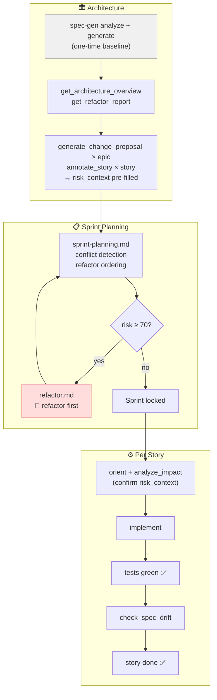

# BMAD assets for spec-gen

BMAD Method implementation of the [spec-gen agentic workflow pattern](../../docs/agentic-workflows/README.md).

See [docs/agentic-workflows/BMAD.md](../../docs/agentic-workflows/BMAD.md) for the full integration guide.

## Workflow



## Setup (BMAD via npm)

### Prerequisites

- Node.js 20+
- BMAD installed in your project: `npx bmad-method install`
- spec-gen MCP server running and indexed (`spec-gen analyze && spec-gen generate`)

### Step 1 — Copy assets into your BMAD project

```bash
# From your project root (where _bmad/ lives)
cp /path/to/spec-gen/examples/bmad/agents/architect.md \
   _bmad/_memory/architect-sidecar/spec-gen.md

cp /path/to/spec-gen/examples/bmad/tasks/*.md \
   _bmad/spec-gen/tasks/

cp /path/to/spec-gen/examples/bmad/templates/*.md \
   _bmad/spec-gen/templates/
```

### Step 2 — Install the architect customization

```bash
cp /path/to/spec-gen/examples/bmad/setup/architect.customize.yaml \
   _bmad/_config/customizations/architect.customize.yaml
```

This tells the BMAD Architect agent to load the spec-gen structural analysis
instructions every time it starts, via the sidecar mechanism.

### Step 3 — Recompile BMAD agents

```bash
npx bmad-method install
```

BMAD recompiles the Architect agent with the new customization. The compiled
markdown agent file now includes a `Load COMPLETE file` directive pointing to
`_bmad/_memory/architect-sidecar/spec-gen.md`.

### Step 4 — Start an architecture session

Open your IDE and start a conversation with the BMAD Architect agent.
The agent will automatically load the spec-gen instructions and begin
with Phase 0 (Structural Reality) before any design work.

---

## Contents

| Path | Purpose | Where it goes in BMAD |
|---|---|---|
| `agents/architect.md` | Architect sidecar — structural analysis before architecture | `_bmad/_memory/architect-sidecar/spec-gen.md` |
| `agents/dev-brownfield.md` | Dev agent fallback gate when planning was skipped | `_bmad/_memory/dev-sidecar/spec-gen-fallback.md` *(optional)* |
| `tasks/onboarding.md` | One-time baseline: analyze + generate specs | `_bmad/spec-gen/tasks/` |
| `tasks/sprint-planning.md` | Sprint validation: conflict detection, refactor ordering | `_bmad/spec-gen/tasks/` |
| `tasks/implement-story.md` | Implementation: risk-proportional orient → code → tests → drift | `_bmad/spec-gen/tasks/` |
| `tasks/refactor.md` | Safe refactor task for risk ≥ 70 stories | `_bmad/spec-gen/tasks/` |
| `templates/story.md` | Story template with `risk_context` section | `_bmad/spec-gen/templates/` |
| `setup/architect.customize.yaml` | BMAD customization — enables sidecar load | `_bmad/_config/customizations/` |
