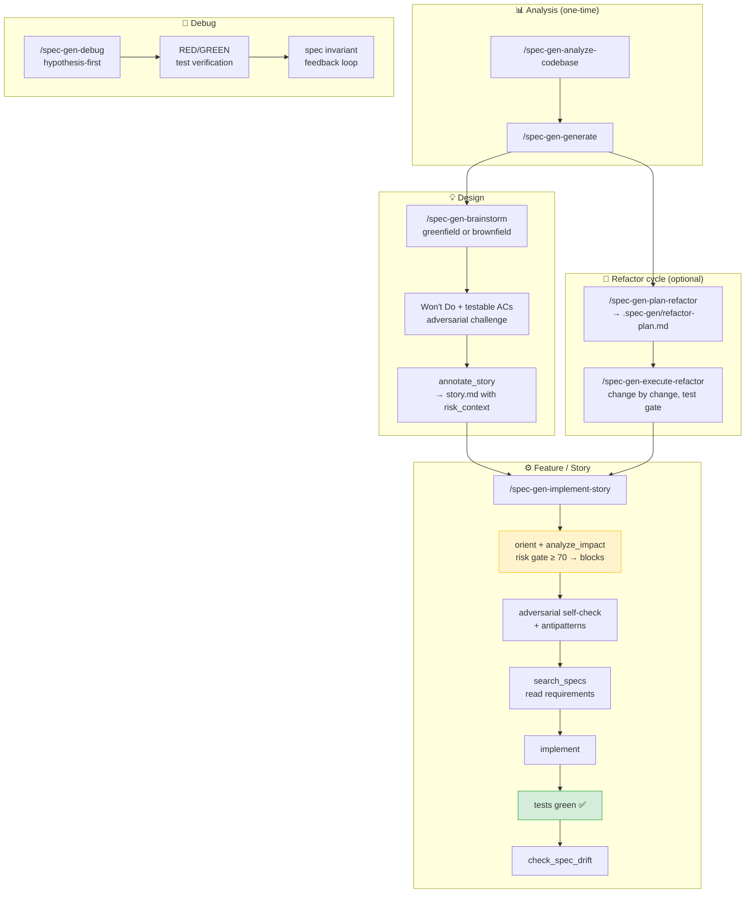

# Mistral Vibe assets for spec-gen

Mistral Vibe implementation of the [spec-gen agentic workflow pattern](../../docs/agentic-workflows/README.md).

## Contents

| Path | Purpose |
|---|---|
| `skills/spec-gen-analyze-codebase/` | Full static analysis — architecture, call graph, refactor issues, duplicates |
| `skills/spec-gen-generate/` | Generate OpenSpec specs from analysis results |
| `skills/spec-gen-brainstorm/` | Design a feature: greenfield (Domain Sketch) or brownfield (Constrained Option Tree) → annotated story |
| `skills/spec-gen-plan-refactor/` | Identify highest-priority refactor target and write a plan |
| `skills/spec-gen-execute-refactor/` | Apply a refactor plan produced by spec-gen-plan-refactor |
| `skills/spec-gen-implement-story/` | Implement a story with structural pre-flight check, test gate, and drift verification |
| `skills/spec-gen-debug/` | Debug a bug: hypothesis-first, RED/GREEN test verification, spec invariant feedback loop |
| `antipatterns-template.md` | Starter template for `.claude/antipatterns.md` — copy to your project root |

## Workflow



## Usage

Copy the skills into your Mistral Vibe project skills directory and invoke them with their slash commands:

```
/spec-gen-analyze-codebase
/spec-gen-generate
/spec-gen-brainstorm
/spec-gen-plan-refactor
/spec-gen-execute-refactor
/spec-gen-implement-story
/spec-gen-debug
```

Each skill follows the generic pre-flight pattern:
- `orient` + `analyze_impact` before any code change
- adversarial self-check + antipatterns read before first edit
- test gate before `check_spec_drift`
- `check_spec_drift` after tests are green

## Antipatterns

Copy `antipatterns-template.md` to `.claude/antipatterns.md` in your project:

```bash
cp examples/mistral-vibe/antipatterns-template.md .claude/antipatterns.md
```

The antipatterns list is read by `spec-gen-brainstorm` (Step 1) and `spec-gen-implement-story` (Step 4b),
and written by `spec-gen-debug` (Step 9d) when a bug reveals a cross-cutting failure pattern.

## OpenSpec spec baseline

`search_specs` and `check_spec_drift` require specs to exist. Run `/spec-gen-generate`
once before using `/spec-gen-implement-story` for the first time — this creates the
baseline that makes spec alignment meaningful.

| State | What to do |
|---|---|
| No specs yet | `/spec-gen-analyze-codebase` then `/spec-gen-generate` |
| Specs exist | All skills work as expected |
| Post-sprint spec refresh | `/spec-gen-generate` again to update specs after new code |

`/spec-gen-implement-story` detects missing specs automatically and tells you what to do.
