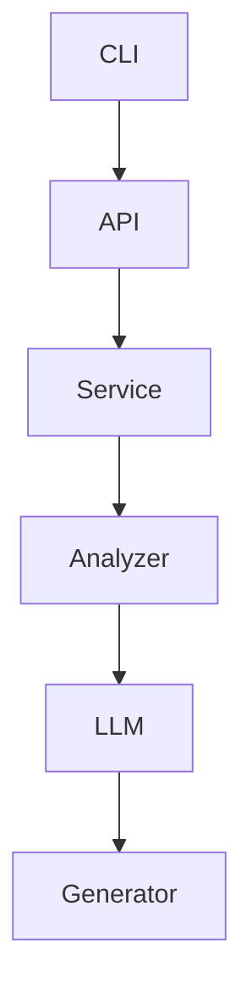

# Architecture Specification

> Generated by spec-gen v1.0.0 on 2026-03-08 16:15

## Purpose

This document describes the architectural patterns and structure of the system.

## Architecture Style

Layered architecture: CLI → API → Service → Analyzer → LLM → Generator. This pattern is chosen to
separate concerns, improve maintainability, and facilitate scalability.

## Requirements

### Requirement: LayeredArchitecture

The system SHALL maintain separation between:
- CLI (Command-line interface for user interaction)
- API (HTTP routing and input validation)
- Service (Business logic and orchestration)
- Analyzer (Static analysis and codebase understanding)
- LLM (Language model interactions and processing)
- Generator (Specification generation and management)

#### Scenario: LayerSeparation
- **GIVEN** a request from the presentation layer
- **WHEN** business logic is needed
- **THEN** the presentation layer delegates to the business layer
- **AND** direct database access from presentation is prohibited

### Requirement: SecurityModel

The system SHALL implement security via: Authentication and authorization are not explicitly detailed in the provided analysis. It is uncertain if the system implements any security measures.

#### Scenario: AuthenticatedAccess
- **GIVEN** an unauthenticated request
- **WHEN** accessing protected resources
- **THEN** access is denied

## System Diagram

## Layer Structure

### CLI

**Purpose**: Command-line interface for user interaction
**Location**: `spec-gen run, startMcpServer, configureServer`

### API

**Purpose**: HTTP routing and input validation
**Location**: `specGenGenerate, specGenInit, specGenRun, specGenDrift, specGenVerify`

### Service

**Purpose**: Business logic and orchestration
**Location**: `LLMService, ConfigManager, EmbeddingService, ClaudeCodeProvider, MistralVibeProvider, GitDiffService, SpecMapper, OpenSpecValidator, OpenSpecConfigManager, OpenSpecFormatGenerator, MappingGenerator, ADRGenerator, OpenSpecWriter, SpecGenerationPipeline, SpecVerificationEngine, SubgraphExtractor, ArchitectureWriter, DependencyGraphBuilder, DependencyGraphConverter, FileWalker, RefactorAnalyzer, VectorIndex, ImportParser, ExportParser, ImportExportParser, SignatureExtractor, AnalysisArtifactGenerator, CallGraphBuilder, DuplicateDetector, SignificanceScorer, AnalysisHandlers, AnalysisService, SemanticService, ProjectDetector, ChatTools, ChatAgent`

### Analyzer

**Purpose**: Static analysis and codebase understanding
**Location**: `RepositoryMapper, DependencyGraphBuilder, CallGraphBuilder, FileWalker, ImportParser, ExportParser, ImportExportParser, SignatureExtractor, AnalysisArtifactGenerator, DuplicateDetector, SignificanceScorer, AnalysisHandlers, AnalysisService, SemanticService, ProjectDetector`

### LLM

**Purpose**: Language model interactions and processing
**Location**: `LLMService, EmbeddingService, ClaudeCodeProvider, MistralVibeProvider`

### Generator

**Purpose**: Specification generation and management
**Location**: `OpenSpecFormatGenerator, MappingGenerator, ADRGenerator, OpenSpecWriter, SpecGenerationPipeline, SpecVerificationEngine, SubgraphExtractor, ArchitectureWriter`

## Data Flow

CLI command → API endpoint → Service layer → Analyzer → LLM → Generator → Persistence. Data flows
from user input through the CLI, into the API layer, processed by services, analyzed by the
analyzer, sent to the LLM for processing, and finally generated and persisted by the generator.

## External Integrations

| System | Purpose |
|--------|---------|
| OpenAI | External integration |
| Ollama | External integration |
| LocalAI | External integration |
| vLLM | External integration |
| LM Studio | External integration |
| Anthropic Claude | External integration |
| Google Gemini | External integration |
| LanceDB | External integration |
