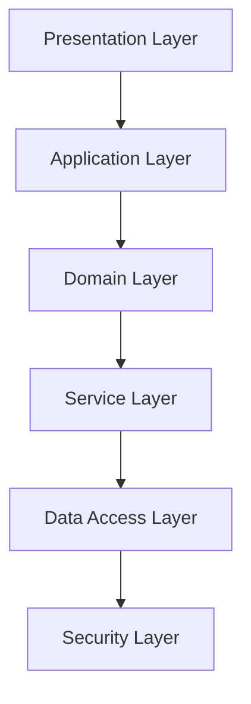

# Architecture Specification

> Generated by spec-gen v1.0.0 on 2026-03-01 16:52

## Purpose

This document describes the architectural patterns and structure of the system.

## Architecture Style

Layered architecture, justified by the clear separation of concerns across distinct domains (e.g.,
analyzer, generator, drift, verifier) and the hierarchical organization of components. This pattern
promotes modularity, maintainability, and scalability, as each layer encapsulates specific
functionality and interacts primarily with adjacent layers.

## Requirements

### Requirement: LayeredArchitecture

The system SHALL maintain separation between:
- Presentation Layer (Handles user interaction and CLI command processing.)
- Application Layer (Orchestrates high-level workflows, manages tasks, and coordinates domain-specific services.)
- Domain Layer (Encapsulates core business logic and domain-specific rules for analysis, generation, verification, and drift detection.)
- Service Layer (Provides reusable services and utilities that support domain operations, such as LLM interactions, dependency analysis, and file parsing.)
- Data Access Layer (Manages data persistence, retrieval, and external integrations, including database interactions and file system operations.)
- Security Layer (Handles authentication, authorization, and session management to ensure secure access to system resources.)

#### Scenario: LayerSeparation
- **GIVEN** a request from the presentation layer
- **WHEN** business logic is needed
- **THEN** the presentation layer delegates to the business layer
- **AND** direct database access from presentation is prohibited

### Requirement: SecurityModel

The system SHALL implement security via: The system employs JWT-based authentication for API and CLI access, with middleware enforcing role-based authorization (e.g., `requireAuth`, `requireRole`). User sessions are managed via tokens, and sensitive operations (e.g., project/task management) are restricted to authenticated users with appropriate roles. Uncertainty exists regarding password storage mechanisms and fine-grained permission scopes.

#### Scenario: AuthenticatedAccess
- **GIVEN** an unauthenticated request
- **WHEN** accessing protected resources
- **THEN** access is denied

## System Diagram

## Layer Structure

### Presentation Layer

**Purpose**: Handles user interaction and CLI command processing.
**Location**: `cli`

### Application Layer

**Purpose**: Orchestrates high-level workflows, manages tasks, and coordinates domain-specific services.
**Location**: `task, project, SpecPipeline, SpecGenerationPipeline, SpecVerificationEngine, DriftAnalyzer`

### Domain Layer

**Purpose**: Encapsulates core business logic and domain-specific rules for analysis, generation, verification, and drift detection.
**Location**: `analyzer, generator, drift, verifier, openspec, llm`

### Service Layer

**Purpose**: Provides reusable services and utilities that support domain operations, such as LLM interactions, dependency analysis, and file parsing.
**Location**: `LLMService, OpenAIProvider, AnthropicProvider, DependencyGraphBuilder, DependencyGraphAnalyzer, ImportExportParser, SignatureExtractor, FileWalker, GitDiffService, ConfigManager`

### Data Access Layer

**Purpose**: Manages data persistence, retrieval, and external integrations, including database interactions and file system operations.
**Location**: `DatabaseConnection, OpenSpecWriter, FileMetadata, RepositoryMap`

### Security Layer

**Purpose**: Handles authentication, authorization, and session management to ensure secure access to system resources.
**Location**: `auth, UserService, APIAuthentication, requireAuth (Middleware), requireRole (Middleware)`

## Data Flow

Data enters the system via CLI commands or API requests, which are processed by the Presentation
Layer. The Application Layer orchestrates workflows, invoking domain-specific services in the Domain
Layer (e.g., analyzer, generator, verifier). These services leverage utilities in the Service Layer
(e.g., LLM interactions, dependency analysis) to process codebase data. Results are persisted or
retrieved via the Data Access Layer, with security enforced by the Security Layer throughout the
flow. Outputs (e.g., OpenSpec docs, drift reports) are returned to the user via the Presentation
Layer.

## External Integrations

| System | Purpose |
|--------|---------|
| OpenAI API | Provides LLM capabilities for specification generation and verification. |
| Anthropic API | Alternative LLM provider for specification generation and verification. |
| PostgreSQL | Stores user data, tasks, projects, and system metadata. |
| Git | Detects code changes for drift analysis by comparing repository states. |
| File System | Reads/writes codebase files, OpenSpec documentation, and analysis artifacts. |
